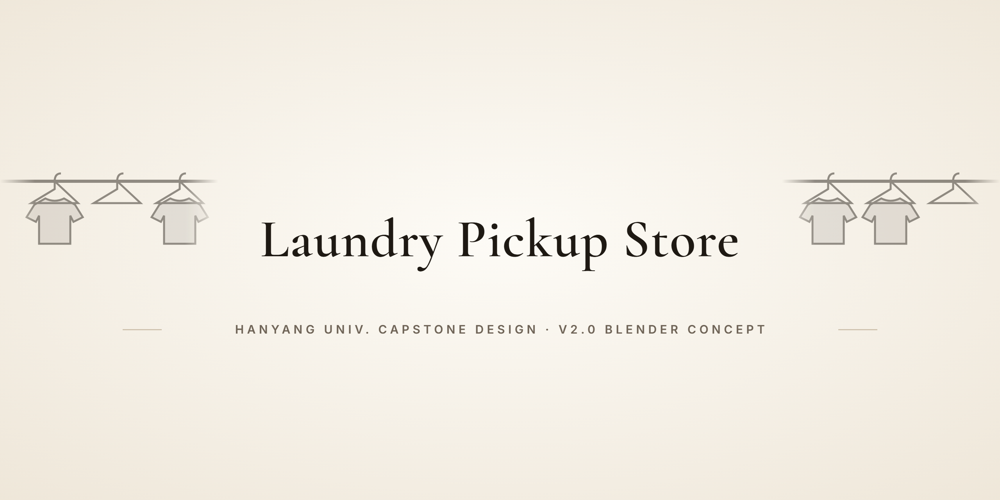
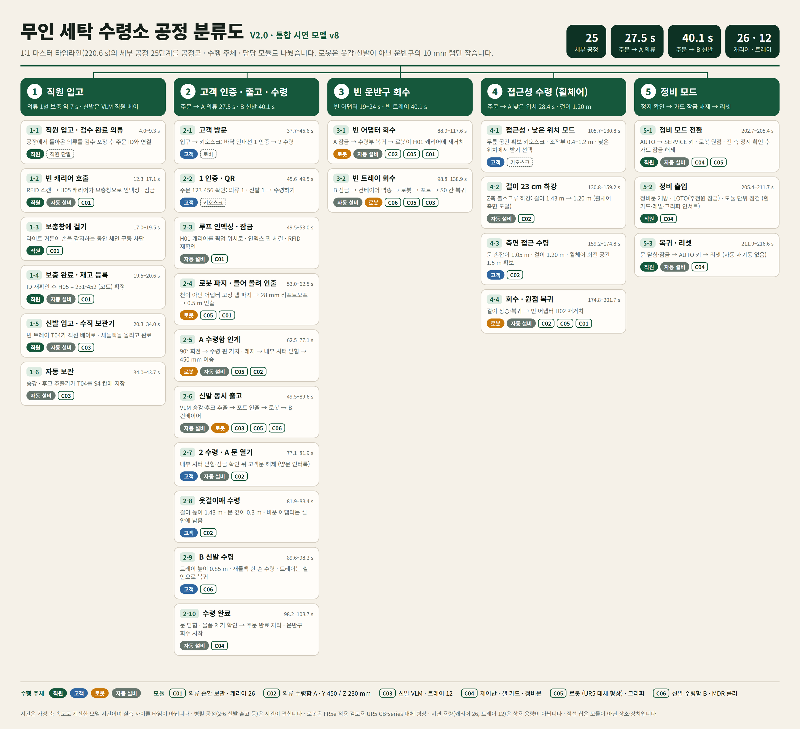
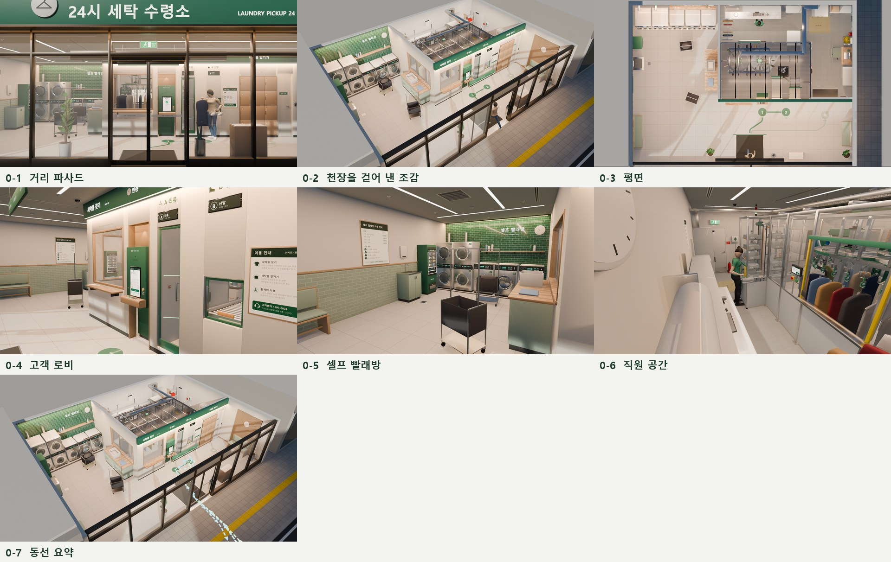
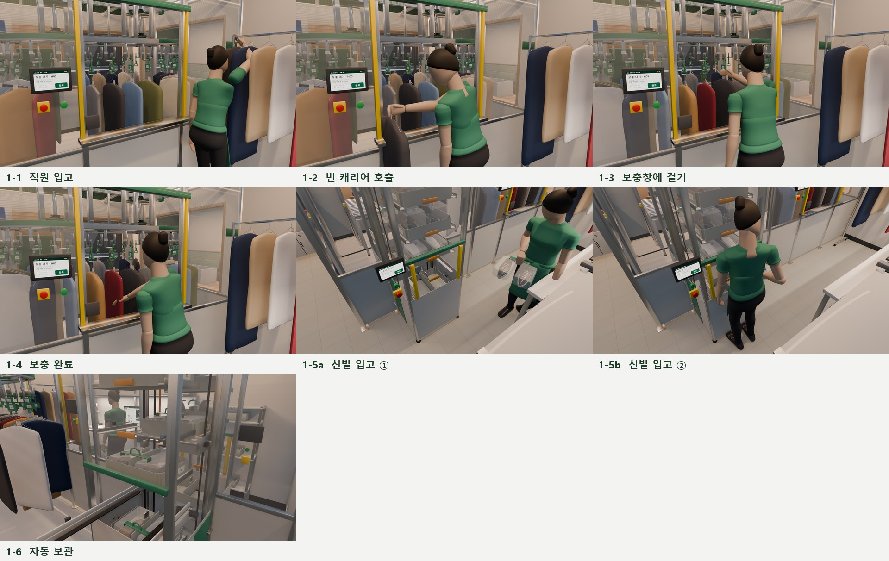
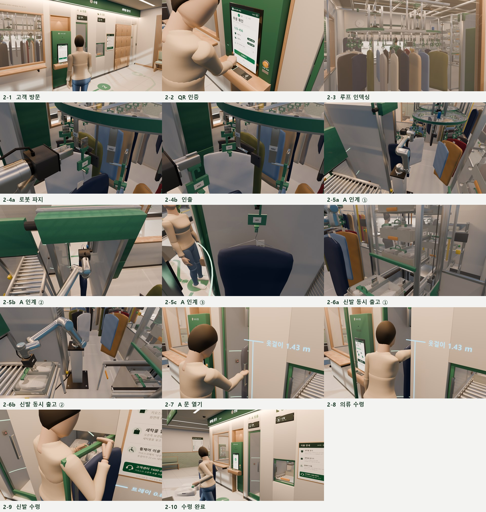
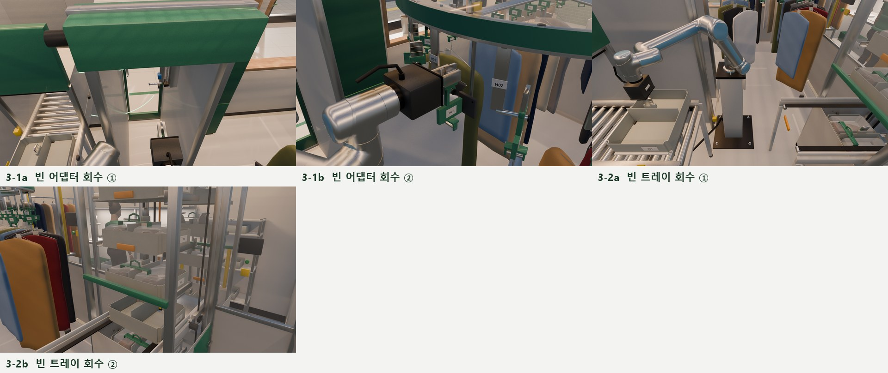
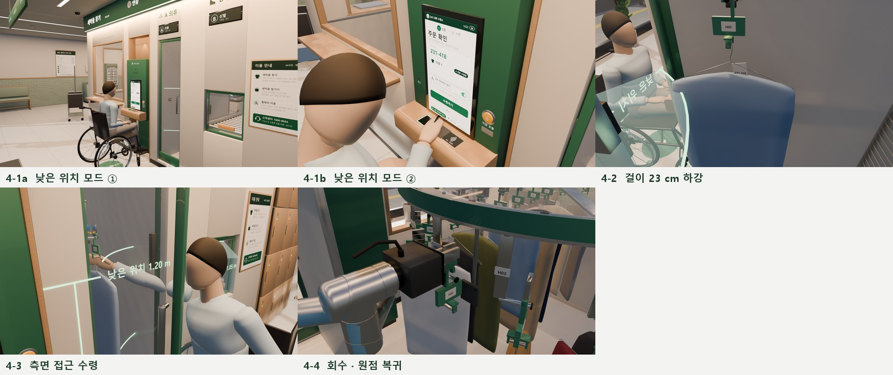
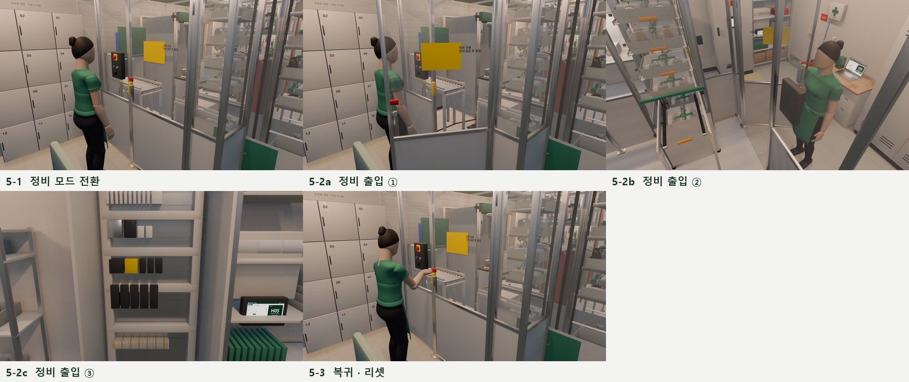
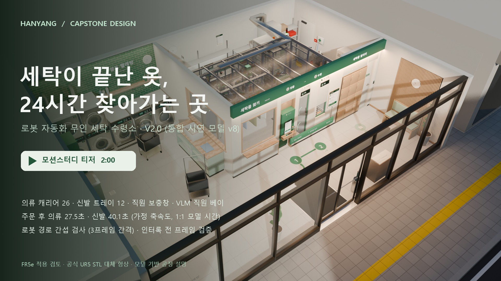
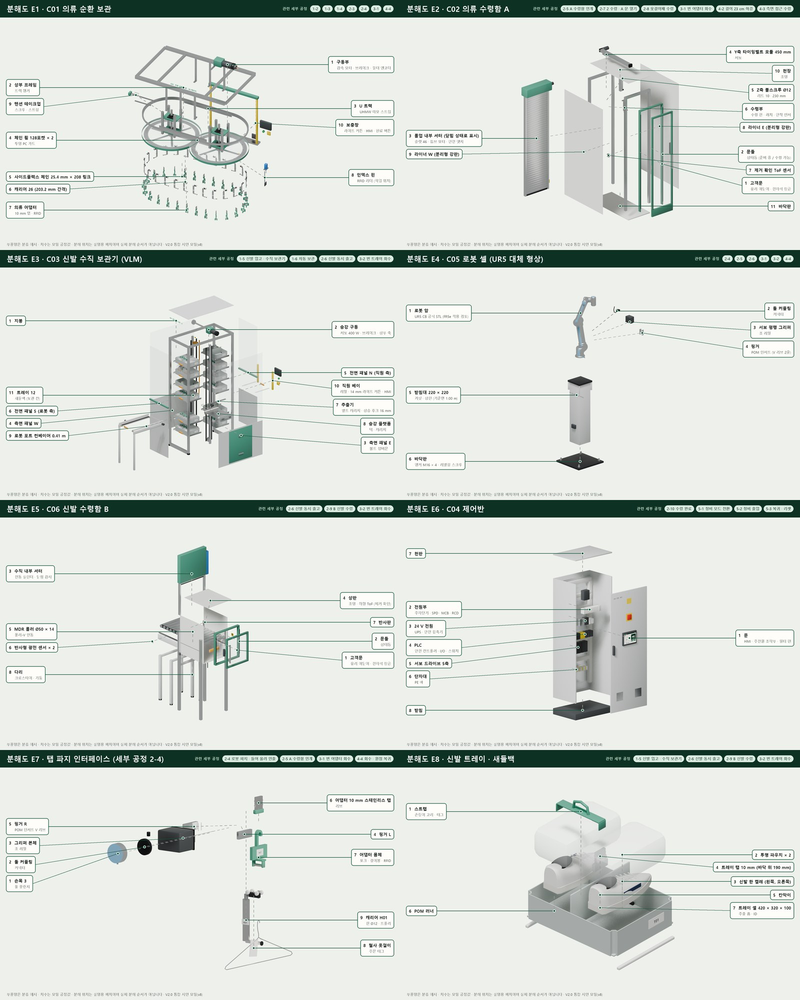

<p align="center">
  
</p>

<p align="center"><a href="README.md">한국어</a> · <b>English</b></p>

# Automated Unmanned Laundry Pickup System (무인 세탁물 수령 시스템)

A Hanyang University Capstone Design project.

> **A 24-hour unmanned pickup store concept: an automated cell stores finished garments and shoes and hands them to customers who authenticate.**
> V2.0 models the whole store (customer lobby, self-service laundry, automated cell, staff area) and the actions of staff, customers and a
> wheelchair user on one 1:1 Blender timeline. The robot only grips the 10 mm tab of a carrier, never fabric or shoes, and people stay outside the moving machinery.

> **Status: V2.0 — a visual, geometric and motion design concept. It is not a built or certified machine.** The saved model was reopened and passed
> 7 automated checks (0 interlock violations over 6,620 frames, 0 robot interference hits over 1,004 frames, and more). Times are model times computed
> from assumed axis speeds, and the robot geometry is a UR5 CB-series stand-in for the target FR5e. Please read [Limitations](#limitations) first.

---

## Why

Letting customers collect finished laundry without a clerk means solving three things together:

- **The right item to the right person.** Only the authenticated order may come out, and two requests must never take the same stock.
- **People stay outside the machine.** Neither staff loading items nor customers taking them may reach a moving mechanism.
- **Two very different items.** Hanging garments and pairs of shoes must be stored and delivered separately in one cell.

V2.0 designs a complete store instead of a lone cell. Customers stay in the lobby, staff in the back, and the machinery inside a guarded cell.
They meet only at two double-door pickup compartments and two light-curtain loading points. Washing, drying, hanging clothes on hangers,
inspection and packing remain human work. The repository holds no market or cost analysis.

## What it does

Demo scale (not commercial capacity or profitability): a 10.5 × 7.5 m store (about 79 m², 2.8 m ceiling), 26 garment carriers (C01 loop),
12 shoe trays (C03 vertical lift module, VLM), one staff garment window, one VLM staff bay, pickup compartments A (garments) and B (shoes),
and a 6,620-frame 1:1 master timeline (220.6 s at 30 fps) with 25 detailed process steps.

| Function | What happens |
|---|---|
| **Staff loading** | Garments: RFID scan → empty carrier indexes to the window → hang → done button. Shoes: the VLM presents an empty tray at the staff bay → place the saddle bag → done. Axes stop while a light curtain sees a hand. |
| **Storage** | Garments on the C01 horizontal chain loop (26 carriers, 203.2 mm pitch); shoes in the C03 VLM (2 columns × 7 levels, 12 storage slots). |
| **Authentication** | QR or pickup number at the kiosk → order check → items reserved → preparation starts. Screens are mockups. |
| **Garment delivery** | C01 index, pin and RFID recheck → C05 tab grip → 28 mm lift-off → 0.5 m radial extraction → 90° turn → A receiver pin and latch → inner shutter closes → Y travel 450 mm. |
| **Shoe delivery** | In parallel: VLM lift and hook extractor → port conveyor → robot → B roller conveyor → inner shutter closes. |
| **Pickup** | Double-door interlock: the customer door unlocks only after the inner shutter is closed and locked. Hanger at 1.43 m, shoe tray at 0.85 m. |
| **Carrier return** | Customers take the hanger with the garment or the saddle bag only. Empty adapters return to their carrier, empty trays to a free VLM slot. |
| **Accessibility** | Low position mode lowers the hanger 23 cm to 1.20 m. 1.5 m turning circle, controls at 0.4–1.2 m. |
| **Service** | SERVICE key → robot home, all axes stopped → guard unlock → service door → LOTO → close and lock → AUTO key → reset. No automatic restart. |

## How it works

```text
 1. Staff loading (axes stop while a light curtain is interrupted)
    garment: RFID scan → empty carrier indexes, pin → hang at window → done, ID recheck → C01
    shoes:   empty tray → VLM staff bay → saddle bag → done → free C03 slot

 2. Authentication (kiosk QR or pickup number)
    order check → reserve items → start garment and shoe preparation together

 3. Garment delivery (order → A ready 27.5 s)
    C01 index, pin, RFID → C05 tab grip → 28 mm lift-off → 0.5 m extraction
    → 90° turn → C02 pin, latch → inner shutter closed → Y 450 mm → A door unlocks

 4. Shoe delivery (order → B ready 40.1 s, in parallel)
    C03 lift, hook → port conveyor → C05 → C06 rollers → inner shutter closed → B door unlocks

 5. Pickup and return
    take hanger or saddle bag → door closed, removal confirmed → order complete
    empty adapter → its C01 carrier, empty tray → free C03 slot
```

## Process images

42 renders taken from the V2.0 1:1 timeline, one or more per detailed step, sorted into six process folders under `images/v2.0/`.
Every image with its (Korean) caption is listed in [docs/v2.0_process_images.md](docs/v2.0_process_images.md).
People are stylized mannequins for reach and flow studies; image 4-2 is a section view with one liner of compartment A hidden.

The process map sorts the 25 detailed steps into five process groups and tags each step with its actors (staff, customer, robot, automated equipment), modules (C01–C06) and master-timeline time. It is generated from the model timeline; labels are in Korean.

<p align="center"></p>

<!-- v2.0-images:start -->
### 0 · Store layout and flows

<p align="center"></p>

Images: [0-1](images/v2.0/0_store/0-1_street_facade.jpg) · [0-2](images/v2.0/0_store/0-2_cutaway_iso.jpg) · [0-3](images/v2.0/0_store/0-3_plan.jpg) · [0-4](images/v2.0/0_store/0-4_lobby.jpg) · [0-5](images/v2.0/0_store/0-5_self_laundry.jpg) · [0-6](images/v2.0/0_store/0-6_staff_area.jpg) · [0-7](images/v2.0/0_store/0-7_flow_summary.jpg)

### 1 · Staff loading (garments, shoes)

<p align="center"></p>

Images: [1-1](images/v2.0/1_staff_loading/1-1_inspect_garment.jpg) · [1-2](images/v2.0/1_staff_loading/1-2_call_empty_carrier.jpg) · [1-3](images/v2.0/1_staff_loading/1-3_hang_at_window.jpg) · [1-4](images/v2.0/1_staff_loading/1-4_confirm_stock.jpg) · [1-5a](images/v2.0/1_staff_loading/1-5a_tray_to_staff_bay.jpg) · [1-5b](images/v2.0/1_staff_loading/1-5b_place_saddle_bag.jpg) · [1-6](images/v2.0/1_staff_loading/1-6_vlm_auto_store.jpg)

### 2 · Authentication, delivery and pickup

<p align="center"></p>

Images: [2-1](images/v2.0/2_order_pickup/2-1_customer_arrives.jpg) · [2-2](images/v2.0/2_order_pickup/2-2_kiosk_qr.jpg) · [2-3](images/v2.0/2_order_pickup/2-3_loop_indexing.jpg) · [2-4a](images/v2.0/2_order_pickup/2-4a_robot_tab_grip.jpg) · [2-4b](images/v2.0/2_order_pickup/2-4b_liftoff_extract.jpg) · [2-5a](images/v2.0/2_order_pickup/2-5a_rotate_to_a.jpg) · [2-5b](images/v2.0/2_order_pickup/2-5b_place_on_receiver.jpg) · [2-5c](images/v2.0/2_order_pickup/2-5c_y_transfer.jpg) · [2-6a](images/v2.0/2_order_pickup/2-6a_vlm_fetch.jpg) · [2-6b](images/v2.0/2_order_pickup/2-6b_port_to_b.jpg) · [2-7](images/v2.0/2_order_pickup/2-7_open_a_door.jpg) · [2-8](images/v2.0/2_order_pickup/2-8_take_garment.jpg) · [2-9](images/v2.0/2_order_pickup/2-9_take_shoes.jpg) · [2-10](images/v2.0/2_order_pickup/2-10_order_complete.jpg)

### 3 · Empty carrier return

<p align="center"></p>

Images: [3-1a](images/v2.0/3_carrier_return/3-1a_adapter_from_a.jpg) · [3-1b](images/v2.0/3_carrier_return/3-1b_rehang_on_h01.jpg) · [3-2a](images/v2.0/3_carrier_return/3-2a_tray_back_to_port.jpg) · [3-2b](images/v2.0/3_carrier_return/3-2b_tray_to_s0.jpg)

### 4 · Accessible pickup (wheelchair)

<p align="center"></p>

Images: [4-1a](images/v2.0/4_accessible_pickup/4-1a_kiosk_knee_space.jpg) · [4-1b](images/v2.0/4_accessible_pickup/4-1b_low_position_select.jpg) · [4-2](images/v2.0/4_accessible_pickup/4-2_hanger_lowering.jpg) · [4-3](images/v2.0/4_accessible_pickup/4-3_side_reach.jpg) · [4-4](images/v2.0/4_accessible_pickup/4-4_return_home.jpg)

### 5 · Service mode

<p align="center"></p>

Images: [5-1](images/v2.0/5_service/5-1_service_key.jpg) · [5-2a](images/v2.0/5_service/5-2a_service_door_open.jpg) · [5-2b](images/v2.0/5_service/5-2b_door_from_inside.jpg) · [5-2c](images/v2.0/5_service/5-2c_cabinet_inside.jpg) · [5-3](images/v2.0/5_service/5-3_close_and_reset.jpg)

<!-- v2.0-images:end -->

## Motion-study teaser (V2.0)

[](videos/process_v2.0_teaser_120s_1080p30.mp4)

**[Watch the V2.0 teaser](videos/process_v2.0_teaser_120s_1080p30.mp4)** · 2:00 · 1920×1080 · 30 fps · Korean narration and graphics ·
[Korean subtitles](videos/process_v2.0_ko.srt) · [shot list (Korean)](docs/v2.0_teaser.md)

- 15 shots cut from the 1:1 master timeline. Only waiting segments are compressed (×1.2–2), and those shots carry an on-screen speed tag.
- Sound: Windows Microsoft Heami Desktop Korean synthetic voice and an ambient bed synthesized with NumPy that ducks under the narration.
- Spec: 120.0 s, 3,600 frames, H.264 (yuv420p) 1920×1080 at 30 fps, AAC 48 kHz stereo, 15 chapters, 36.9 MB, loudness normalized to −16 LUFS.

## How to view

This is a documents-and-media repository with nothing to install or build.

```bash
git clone https://github.com/lsy041015/capstone-design-hanyang-university.git
cd capstone-design-hanyang-university

# e.g. play the V2.0 teaser in mpv with the Korean subtitles
mpv --sub-file=videos/process_v2.0_ko.srt videos/process_v2.0_teaser_120s_1080p30.mp4
```

Reading order: this README → [process images](docs/v2.0_process_images.md) → [process design](docs/v2.0_process_design.md) →
[verification record](docs/v2.0_verification.md) (all in Korean). The 52 design signals, part classes with maintenance proposals and the control
rig properties are CSV files in `docs/`. The editable `.blend` model and the generator scripts are not included in V2.0 either.

## Layout and modules

The store has four zones: customer lobby (entrance, kiosk, pickup compartments, 12 drop-off lockers), self-service laundry (3 washers,
2 double-stack dryers, detergent vending, folding table), the automated cell (robot on a 1.0 m pedestal, 2.4 m guard with mesh roof) and the staff
area (inspection and packing, loading window, VLM bay, C04 control cabinet, service door). V2.0 module codes differ from v7.

| Code | Module | Key specs (nominal model values; part names are class examples) |
|---|---|---|
| **C01** | Garment loop | Side-flex chain, 25.4 mm pitch, 208 links, carrier every 8 links (203.2 mm); two 128-pocket wheels (1,035 mm pitch diameter); 5.283 m path; index pin in 16 bushes; 0.25 m/s assumed |
| **C02** | Garment compartment A | Robot-side roll-up shutter (46 slats), belt Y axis 450 mm, ball-screw Z axis 230 mm (Ø12, 10 mm lead), receiver pin + solenoid latch, glass customer door |
| **C03** | Shoe VLM | South (robot) and north (staff) columns, 7 levels each at 250 mm; level 2 holds the robot port and the staff bay; belt lift, 16 mm hook extractor, 0.41 m port conveyor |
| **C04** | Cabinet and cell | 800 × 550 × 2,000 mm cabinet, 45 mm profile guard, east service door, signal tower |
| **C05** | Robot and gripper | UR5 CB-series stand-in; servo parallel gripper with POM inserts (two V ribs), 30 mm approach, 10 mm grip, TCP 170 mm from the flange |
| **C06** | Shoe compartment B | 24 V MDR roller conveyor (Ø50, 75 mm pitch, 14 rollers), 0.65 m travel through a vertical inner shutter, roller top 0.85 m |

Cycle times on the model timeline (assumed axis speeds, not measured): order → A garment ready 27.5 s, order → B shoes ready 40.1 s,
order → A ready in low position 28.4 s, empty adapter return 19–24 s, empty tray return 40.1 s, staff loading of one garment about 7 s.

### Exploded views

Eight exploded views rendered orthographically from the model: modules C01–C06, the step 2-4 tab-grip interface (gripper, adapter, carrier) and the shoe tray with its saddle bag. Part lists are in [docs/v2.0_exploded_views.md](docs/v2.0_exploded_views.md) (Korean).

<p align="center"></p>

<!-- v2.0-exploded:start -->
| View | Subject | Related steps |
|---|---|---|
| [E1](images/v2.0/exploded/E1_c01_garment_loop.png) | C01 의류 순환 보관 | 1-2 · 1-3 · 1-4 · 2-3 · 2-4 · 3-1 · 4-4 |
| [E2](images/v2.0/exploded/E2_c02_garment_compartment_a.png) | C02 의류 수령함 A | 2-5 · 2-7 · 2-8 · 3-1 · 4-2 · 4-3 |
| [E3](images/v2.0/exploded/E3_c03_shoe_vlm.png) | C03 신발 수직 보관기 (VLM) | 1-5 · 1-6 · 2-6 · 3-2 |
| [E4](images/v2.0/exploded/E4_c05_robot_cell.png) | C05 로봇 셀 (UR5 대체 형상) | 2-4 · 2-5 · 2-6 · 3-1 · 3-2 · 4-4 |
| [E5](images/v2.0/exploded/E5_c06_shoe_compartment_b.png) | C06 신발 수령함 B | 2-6 · 2-9 · 3-2 |
| [E6](images/v2.0/exploded/E6_c04_control_cabinet.png) | C04 제어반 | 2-10 · 5-1 · 5-2 · 5-3 |
| [E7](images/v2.0/exploded/E7_tab_grip_interface.png) | 탭 파지 인터페이스 (세부 공정 2-4) | 2-4 · 2-5 · 3-1 · 4-4 |
| [E8](images/v2.0/exploded/E8_shoe_tray_saddle_bag.png) | 신발 트레이 · 새들백 | 1-5 · 2-6 · 2-9 · 3-2 |
<!-- v2.0-exploded:end -->

Offsets are for illustration, not a disassembly sequence. E2 shows the inner shutter closed; E7 shows the pose at the tab-grip moment (master 56.5 s).

## Verification

Checks reopen the saved model and evaluate real frames. They cover Blender geometry and logic only, not loads, purchased-part ratings,
PLC or safety circuits, or measured FR5e kinematics. Raw data: [docs/v2.0_verification.json](docs/v2.0_verification.json).

| Check | Result |
|---|---|
| Drivers valid and simple (no Python auto-run) | 223, 0 errors |
| Kinematic couplings (wheel, carrier, pulley, screw, roller, lift), 414 samples | worst 0.024 mm (carrier) |
| Robot rig vs. numpy forward kinematics | ≤ 1.2 × 10⁻⁶ m |
| Joint limits and speed (UR5 CB nominal) | max 72°/s, TCP ≤ 1.08 m/s |
| Cargo handoff continuity (31 handoffs) | max 0.78 mm |
| Interlock logic on every frame | 6,620 frames, 0 violations |
| Robot interference (every 3rd of 3,012 motion frames: 7 links + gripper + carried cargo vs. all meshes within 2 m) | 1,004 frames, 0 hits |
| Loop garment spacing (12 chain positions × 26 garments) | 2,680 pairs, 0 overlaps |

Video: the published MP4 passed (all 3,600 frames decode without errors, 15 chapters, mean −18.7 dB / max −1.5 dB; SHA-256 in [docs/v2.0_video_verification.json](docs/v2.0_video_verification.json)). Camera-to-person clearance: no case under 0.5 m over all 3,600 teaser frames and 42 stills. Not checked: contact between sampled frames, cloth deformation, robot self-collision, dynamics, sensor response,
safety performance level, stopping distance, electrical design.

## Previous versions

Earlier material stays unchanged. The full v7 README is archived in [docs/v7_overview.en.md](docs/v7_overview.en.md).
v7 covered the cell only (31 static inspection poses, 177 automated checks, 8 garment and 4 tray slots, modules C01–C07) with its
[2-minute teaser](videos/process_v7_teaser_120s_1080p30.mp4); the older [60 s v4 video](videos/process_v4_60s_1080p30.mp4) shows 86 steps.
Do not mix v7 and V2.0 numbers.

## Repository contents

```text
README.md / README.en.md            project description (Korean / English)
docs/v2.0_*                         V2.0 process images, design, verification, teaser notes, CSV lists
docs/v7_* , docs/UR5_LICENSE.txt    archived v7 docs, UR5 mesh notice
images/v2.0/<process>/*.jpg         V2.0 process images (6 folders) + one sheet per process
images/v2.0/process_map.png         V2.0 process map (5 groups, 25 steps)
images/v2.0/exploded/*.png          V2.0 exploded views E1–E8 + exploded_sheet.jpg
images/01_…–12_…, process_gallery   v7 renders
videos/process_v2.0_*               V2.0 teaser and Korean subtitles
videos/process_v7_*, process_v4_*   earlier videos and subtitles
```

## Tools

Blender 5.2.1 LTS (EEVEE), system Python 3.10.9 with NumPy 1.26.4, SciPy 1.10.0 and Pillow 9.5.0, FFmpeg 8.1.1, Microsoft Heami Desktop voice,
and UR5 CB-series meshes pinned to Universal Robots ROS 2 Description commit `89bbe795f38a7ab00fb66fe8831dfff79dc99edf`.

## Design notes

- **Pick at the wheel tip, pull out radially.** Garments hang perpendicular to the rail, so they fan out at the wheel. After gripping the tab the robot
  lifts 28 mm and pulls 0.5 m radially, which clears the outer ends of the neighbours.
- **One tab for everything.** Adapters and trays share a 10 mm stainless tab, so one gripper insert handles garments and shoes.
- **Elbow-up solutions first.** An early path swept the arm through a corner post of compartment A. Preferring elbow-up IK solutions and retreating
  0.40 m instead of 0.16 m before the shutter brought robot interference to 0 over 1,004 frames.
- **One control rig.** Every axis and signal is a property of `V8_CTRL`; all 223 drivers are simple expressions, so the model runs without Python auto-run.
- **Show hidden motion as a section.** Hanger lowering happens behind a closed shutter. A section camera hides one liner instead of moving the mechanism,
  and the video labels it as a section view.
- **Keep cameras out of people's way.** The staff member walked through the VLM-bay camera, which flashed about 0.5 s of mannequin interior into the video.
  A per-frame camera-to-person clearance check found it; the camera moved 0.98 m clear of the path and the shot was re-rendered.
- **Screens match the scenario.** The kiosk first had one order's screens only, so the wheelchair user saw the previous customer's order number. The second order
  (231-418, garment only, low position) now has its own three screens, and the staff-side screens show the real loading target (carrier H05, tray T04, order 231-452).

## Limitations

- Replace the UR5 stand-in with real FR5e CAD, TCP, payload and tool mass, then re-verify paths and self-collision. Garments are rigid approximations.
- Size chain, belts, ball screw, brakes and gripper for load, torque, deflection and stopping distance. Part names are class examples.
- Implement and test a PLC and an independent safety circuit (dual channel, stop categories, restart).
- Measure staff loading and customer pickup with real people, including the estimated 0.65 m side reach from a wheelchair.
- Payment, QR, order, inventory and notification services exist only as screens and logic conditions.
- Demo capacity (26 garments, 12 trays) is not commercial capacity. The 1:1 times and the 2-minute video are not measured cycle times.
- Without the `.blend` file and scripts the model cannot be opened or re-checked from this repository.

## Credits and license

- **License**: there is no repository-wide license file. The UR5 notice covers only the UR5 meshes, not the text, images or videos here.
- **UR5 meshes**: official Universal Robots UR5 CB-series simplified STL geometry from
  [Universal Robots ROS 2 Description](https://github.com/UniversalRobots/Universal_Robots_ROS2_Description/tree/89bbe795f38a7ab00fb66fe8831dfff79dc99edf/meshes/ur5/collision),
  pinned to commit `89bbe795f38a7ab00fb66fe8831dfff79dc99edf`; BSD-3-Clause notice in [docs/UR5_LICENSE.txt](docs/UR5_LICENSE.txt). Not original work of this project.
- **Stand-in robot**: the target robot is the FR5e. Do not present UR5 specifications or geometry as FR5e performance.
- **Sound**: Windows Microsoft Heami Desktop Korean voice; the V2.0 ambient bed was synthesized with NumPy, with no external music.

---

<p align="center"><sub>LSY.KOR · <a href="https://github.com/lsy041015">More projects</a></sub></p>
