<p align="center">
  
</p>

<p align="center"><b>한국어</b> · <a href="README.en.md">English</a></p>

# 무인 세탁물 수령 시스템 (Automated Unmanned Laundry Pickup System)

한양대학교 캡스톤디자인(Hanyang University Capstone Design) 프로젝트입니다.

> **직원이 검수·포장·등록한 세탁 완료품을 자동화 셀이 보관하고, 고객이 인증하면 그 의류나 신발을 꺼내 주는 소형 매장용 무인 수령 시스템 컨셉입니다.**
> Blender 모델의 렌더와 2분짜리 공정 설명 영상으로 설계를 보여 줍니다. 로봇은 옷감이나 신발 대신 단단한 어댑터와 트레이만 잡고,
> 직원과 고객은 움직이는 기계 밖에 머뭅니다.

> **상태: 시각·기하 설계 컨셉입니다. 제작하거나 인증받은 기계가 아닙니다.** 원본 검사 모델은 정지 포즈 31개에서 자동 검사 177개를 통과했고,
> 내부 컨셉 검토 점수는 32/100에서 74/100으로 올랐습니다. 검사는 모델 위의 기하·스크립트 검사이며 연속 충돌이나 안전을 증명하지 않습니다.
> 로봇 형상은 목표 기종 FR5e가 아닌 UR5 CB-series 대체 메시입니다. [한계와 다음 단계](#13-한계와-다음-단계)를 먼저 읽어 주세요.

---

## 목차

1. [왜 만들었나](#1-왜-만들었나)
2. [한눈에 보기](#2-한눈에-보기)
3. [동작 방식](#3-동작-방식)
4. [공정 설명 영상 (v7)](#4-공정-설명-영상-v7)
5. [렌더 갤러리](#5-렌더-갤러리)
6. [자료 보는 방법](#6-자료-보는-방법)
7. [운영 흐름](#7-운영-흐름)
8. [기구 구성](#8-기구-구성)
9. [설계 검토와 검증](#9-설계-검토와-검증)
10. [저장소 구조](#10-저장소-구조)
11. [기술 스택](#11-기술-스택)
12. [만들면서 고민한 것](#12-만들면서-고민한-것)
13. [한계와 다음 단계](#13-한계와-다음-단계)
14. [출처와 라이선스](#14-출처와-라이선스)

---

## 1. 왜 만들었나

매장 직원이 직접 건네주지 않아도 고객이 세탁 완료품을 찾아가게 하려면 세 가지를 함께 풀어야 합니다.

- **맞는 물품을 맞는 사람에게.** 인증한 고객에게 그 주문의 의류나 신발만 나와야 하고, 같은 재고를 두 요청이 가져가면 안 됩니다.
- **사람은 기계 밖에.** 직원이 물품을 넣을 때도, 고객이 꺼낼 때도 움직이는 기구에 손이 닿지 않아야 합니다.
- **모양이 다른 두 물품.** 옷걸이에 거는 의류와 트레이에 담는 신발을 한 셀 안에서 따로 보관하고 내줘야 합니다.

이 컨셉은 국내 소형 매장을 가정하고 일을 셋으로 나눴습니다. 직원은 검수·포장·등록과 보충을, 자동화 셀은 보관·인출·전달과
빈 운반구 회수를, 고객은 인증과 수령만 맡습니다. 저장소에는 시장 조사나 비용 분석 자료가 없습니다.

## 2. 한눈에 보기

시연 모델의 규모는 다음과 같습니다. 상용 매장의 용량이나 수익성을 뜻하지 않습니다.

- 의류 캐리어 위치 8개
- 신발 트레이 위치 4개
- 공용 직원 보충구 1개
- 로봇 셀 1개: FR5e 적용 검토를 위해 공식 UR5 CB-series STL을 시각 대체물로 사용
- 보관·인출·고객 수령·빈 운반구 회수·보충을 다루는 정지 검사 포즈 31개

| 기능 | 하는 일 |
|---|---|
| **직원 보충** | 직원이 검수·포장·등록한 물품을 C07 보충구에 넣습니다. 문을 닫고 잠근 뒤 작업자가 리셋해야 자동 운전이 다시 시작됩니다. |
| **보관** | 의류는 C01 캐리어 루프에, 신발은 C03 승강대와 3단 포크가 4단 선반에 보관합니다. |
| **고객 인증** | 키오스크에서 수령번호를 입력하거나 QR을 보여 주면 주문·수령 권한·물품 위치를 확인하고 재고를 예약합니다. 화면은 목업입니다. |
| **의류 전달** | C05 로봇이 어댑터 탭을 잡아 C02 수령대에 넘기고, 수령대가 Y 730 mm, Z 300 mm를 움직여 A 의류함에 도착합니다. |
| **신발 전달** | 포크가 꺼낸 트레이를 벨트와 롤러가 옮기고, 로봇이 손잡이를 잡아 출구 롤러를 거쳐 B 신발함에 넣습니다. |
| **빈 운반구 회수** | 고객이 물품만 가져가면 남은 어댑터와 트레이를 보관부로 되돌립니다. |
| **제어 조건** | 문 닫힘·잠금, 비상정지, 리셋, 로봇 원위치, 위치·ID, 적재, 파지 확인이 맞아야 다음 동작을 허용합니다. 실패하면 멈추고 작업자 확인을 기다립니다. |
| **결과물** | 렌더 12장과 모음 이미지, 2분 v7 공정 영상과 자막 2종, 이전 v4 영상, 영상 검증 기록(JSON). |

## 3. 동작 방식

셀은 사람이 닿는 곳(C07 직원 보충구, C06 고객 수령함)과 기계만 움직이는 안쪽을 문으로 나눕니다.
안쪽에서는 C05 로봇이 어댑터와 트레이를 옮기고, 모든 전환은 문·위치·ID·파지 확인을 통과해야 일어납니다.

```text
 1. 직원 보충 (C07 문 닫힘·잠금 + 작업자 리셋 뒤에만 자동 운전)
    C07 ─▶ C05 ─┬─▶ C01   의류: 어댑터를 빈 캐리어에 (8슬롯)
                └─▶ C03   신발: 트레이를 인피드 → 승강대 → 포크로 (4단)

 2. 고객 인증 (키오스크)
    수령번호 또는 QR → 주문·물품 위치 확인 → 재고 예약

 3. 의류 전달
    C01 인덱싱 → C05 어댑터 탭 파지 → C02 수령대 (Y 730 mm, Z 300 mm)
    → C06 A 의류함 (내부문이 닫히고 잠겨야 고객문이 열림)

 4. 신발 전달
    C03 포크 인출·승강 → 인피드 롤러 → C05 트레이 중앙 이송 → 출구 롤러
    → C06 B 신발함 (외부 셔터가 잠긴 동안에만 내부 셔터가 열림)

 5. 빈 운반구 회수 (물품 제거 + 고객문 닫힘·잠금 뒤)
    빈 어댑터: C02 수령대 복귀 → C05 → C01 캐리어
    빈 트레이: 내부 롤러 → C05 → C03 인피드·벨트·승강대·포크 → 빈 보관 위치

 C04 제어반: 문 잠금·비상정지·리셋·로봇 원위치·위치·ID·적재·파지 확인이
 맞아야 다음 동작. 하나라도 실패하면 정지 상태 유지, 작업자 확인·리셋
```

저장소에는 목적이 다른 모델과 영상이 셋 있습니다.

- **v7 원본 검사 모델**: 정지 검사 포즈 31개. 자동 검사 177개의 대상입니다.
- **v7 티저 영상**: 같은 v7 형상으로 따로 만든 파일입니다. 21장면, 3,600프레임, 120초이며 포즈 번호와 프레임 번호가 다릅니다.
- **v4 이전 영상**: 86개 세부 공정, 60초. 이전 형상과 슬롯 수를 쓰므로 현재 설계와 구분합니다.

포즈 번호도, 영상의 2분도 측정한 설비 사이클 타임이 아닙니다.

## 4. 공정 설명 영상 (v7)

현재 설계를 2분 동안 21장면으로 설명하는 영상입니다.

[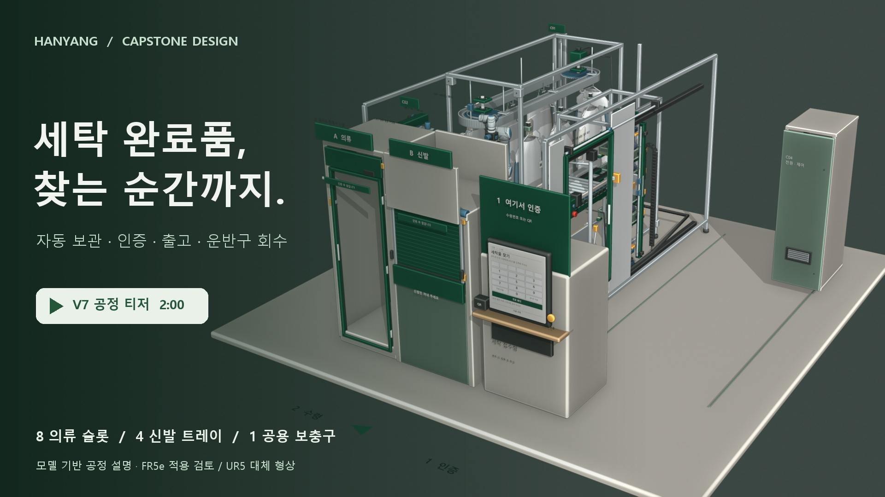](videos/process_v7_teaser_120s_1080p30.mp4)

**[v7 공정 티저 보기](videos/process_v7_teaser_120s_1080p30.mp4)** · 2:00 · 1920×1080 · 30 fps · 한국어 내레이션·그래픽

[장면별 설명과 검증 범위](docs/v7_process_teaser.md) · [한국어 자막](videos/process_v7_ko.srt) · [English subtitles](videos/process_v7_en.srt)

- **재생**: GitHub은 저장소에 든 MP4를 README 안에서 재생하지 않습니다. 그래서 포스터를 영상 파일에 연결했습니다.
  누르면 파일 페이지로 이동하고, 내려받아 재생할 수 있습니다.
- **규격**: 120.0초, 3,600프레임, H.264 영상, AAC 48 kHz 2채널 한국어 음성, 25.7 MB.
- **내레이션**: Windows의 Microsoft Heami Desktop 한국어 합성 음성입니다. 배경 음악은 없습니다.
- **자막**: MP4 안에는 자막 트랙이 없습니다. 한국어 대사는 `videos/process_v7_ko.srt`, 영문 자막은 `videos/process_v7_en.srt`에 있고,
  재생기에서 필요한 언어를 외부 자막으로 불러옵니다. 설명 그래픽이 한국어로 화면에 들어가 있어서, 영문이 자동으로 겹치지 않도록 일부러 넣지 않았습니다.

**영상이 보여 주는 것.** 직원 보충 → 인증 → 의류 전달 → 신발 전달 → 빈 운반구 회수 → 제어 조건 순서입니다. 근접 장면에서 단단한 의류 어댑터,
Y–Z로 연동되는 수령대, 신발 텔레스코픽 포크, 트레이 인계, 인터록 수령함을 보여 주고, 한국어 그래픽이 동작과 다음 단계 전에 필요한 확인을 설명합니다.

**영상을 볼 때 알아 둘 것.**

- 모델 기반 공정 설명입니다. 보충구와 저장부 사이 이동 같은 구간은 컷 전환으로 요약했고, 동작은 발표용으로 시간을 압축했습니다.
  120초를 설비 사이클 타임으로 쓸 수 없습니다.
- 사람은 등장하지 않습니다. 직원 적재와 고객 수령 장면은 물품만 움직여 표현했습니다. 자동으로 옷을 걸거나 신발을 포장하는 기능이 아닙니다.
- 직원은 검수, 포장, 물품 등록, 보충구 적재, 이상 확인과 리셋을 맡고, 고객은 인증 후 의류나 신발을 가져갑니다.
  자동화 셀은 어댑터와 트레이를 통해 보관·인계·수령 위치 이송·빈 운반구 반환을 맡도록 설계했습니다.
- QR 화면, 센서, 안전 조건은 컨셉 표현입니다. 문 잠금·ID·물품 존재·파지 확인은 실제 센서 입력으로 구현해야 하는 허용 조건이며,
  문 애니메이션만으로 실물 안전성이 검증되지는 않습니다.

### 장면별 공정

시간은 영상 재생 위치이며 설비의 실제 소요 시간이 아닙니다. C01–C07은 [기구 구성](#8-기구-구성)과 같습니다.

| 시간 | 공정 | 동작과 확인 조건 |
|---|---|---|
| 00:00–00:05 | 프로젝트 소개 | 보관·인증·출고·운반구 회수의 전체 셀과 시연 용량을 소개합니다. |
| 00:05–00:12 | C07 직원 의류 보충 | 직원이 등록한 의류를 보충구 어댑터에 겁니다. 문이 열려 있는 동안 로봇은 정지합니다. 문 닫힘·잠금·작업자 리셋 뒤에 C05가 어댑터를 집습니다. |
| 00:12–00:16 | C01 의류 입고 | 어댑터를 빈 캐리어 지지부에 내려놓고 파지를 풉니다. 안착·물품 ID·슬롯 위치를 확인한 뒤 재고를 확정하는 설계입니다. 보충구에서 저장부까지의 이동은 컷 전환으로 요약했습니다. |
| 00:16–00:23 | C07 직원 신발 보충 | 접이식 선반에 표준 트레이를 놓고 신발을 담습니다. 작업자가 문을 닫고 리셋하면 로봇이 트레이 손잡이를 잡아 들어 올립니다. |
| 00:23–00:28 | C03 신발 보관 | 승강대의 3단 포크가 트레이를 S02 위치로 밀어 넣고, 내려놓은 뒤 빠져나옵니다. 보충구·인피드 구간은 컷 전환으로 요약했습니다. |
| 00:28–00:33 | 고객 인증·예약 | 수령번호 또는 QR로 주문과 물품 위치를 확인하고 해당 재고를 예약하는 흐름입니다. 화면은 목업이며 인증 서버와 연결돼 있지 않습니다. |
| 00:33–00:38 | C01 의류 인덱싱 | 요청한 의류의 캐리어를 로봇 픽업 위치로 보냅니다. 정위치 잠금과 물품 ID 재확인 뒤 다음 동작을 허용합니다. |
| 00:38–00:43 | C05 의류 파지 | 옷감을 직접 잡지 않고 단단한 어댑터 탭을 집습니다. 파지를 확인한 뒤 지지 핀 위로 들어 올립니다. |
| 00:43–00:48 | C02 수령대 인계 | 로봇이 어댑터를 수령대 받침에 내려놓습니다. 받침이 하중을 넘겨받고 유지 래치가 잡은 다음 그리퍼가 열립니다. |
| 00:48–00:54 | C02 Y–Z 이송 | 수령대와 Z 모듈이 함께 Y 방향으로 730 mm 이동한 뒤 Z 방향으로 300 mm 내려갑니다. 내부문 닫힘·잠금이 고객문 개방의 선행 조건입니다. |
| 00:54–00:59 | C06 의류 수령 | 고객은 옷걸이와 의류를 가져갑니다. 운반 어댑터는 수령대에 남습니다. 물품 제거와 고객문 닫힘을 확인해야 회수를 시작합니다. |
| 00:59–01:05 | 빈 어댑터 회수 | 고객문이 잠긴 뒤 수령대가 복귀합니다. 로봇이 빈 어댑터를 들어 원래 H05 캐리어에 다시 겁니다. |
| 01:05–01:12 | C03 신발 인출·승강 | 포크가 600 mm 뻗어 트레이를 받칩니다. 20 mm 들어 올려 회수하고, 승강대가 벨트 인계 높이로 이동한 뒤 내려놓습니다. |
| 01:12–01:17 | C03 인피드 | 연결 롤러가 트레이를 픽업 스토퍼까지 옮깁니다. 위치·ID를 확인한 뒤 로봇이 손잡이를 집습니다. |
| 01:17–01:23 | C05 트레이 중앙 이송 | 받침대를 피하도록 트레이를 들어 올려 중앙을 지납니다. 출구 롤러에 내려놓고 파지를 푼 뒤 로봇이 물러납니다. |
| 01:23–01:28 | C06 신발함 투입 | 외부 셔터가 잠긴 동안 내부 셔터가 열립니다. 트레이가 들어가면 내부 셔터를 닫고 잠급니다. |
| 01:28–01:33 | C06 신발 수령 | 고객이 신발만 가져가고 재사용 트레이는 남깁니다. 물품 제거·손 감지 해제·외부 셔터 닫힘이 다음 동작의 조건입니다. |
| 01:33–01:41 | 빈 트레이 반송 | 고객 측 셔터가 잠기면 내부 롤러가 트레이를 되돌립니다. 로봇이 들어 올려 인피드 롤러에 다시 내려놓습니다. |
| 01:41–01:47 | C03 빈 트레이 재입고 | 벨트·승강대·포크가 빈 트레이를 S02로 돌려보냅니다. 수령 완료와 빈 운반구 반환 기록으로 한 주문의 순환을 끝냅니다. |
| 01:47–01:54 | C04 제어 조건 | 문 닫힘·잠금, 위치·ID, 파지·안착을 확인합니다. 이상이 생기면 정지 상태를 유지하고 작업자가 확인·리셋하는 조건을 설명합니다. |
| 01:54–02:00 | 전체 공정 정리 | 직원 보충부터 고객 수령과 운반구 회수까지 이어진 흐름을 정리합니다. |

<details>
<summary>이전 v4 영상 — 비교용으로 보관</summary>

[60초 v4 영상 보기·내려받기](videos/process_v4_60s_1080p30.mp4). 86개 세부 공정을 1920×1080, 30 fps로 담았습니다(24.3 MB, 음성 트랙 없음).
이전 형상과 슬롯 수를 쓰므로, 현재 설계를 소개할 때는 위의 v7 티저를 쓰세요.

</details>

## 5. 렌더 갤러리

모델에서 뽑은 장면입니다. 번호는 `images/` 폴더의 파일 번호와 같습니다.

<p align="center"></p>
<p align="center"><sub>01 전체 공정셀 — 앞쪽에 A 의류 문, B 신발 셔터, "1 여기서 인증" 키오스크, 안쪽에 로봇과 C01 루프, 오른쪽에 C04 제어반</sub></p>

<table>
<tr>
<td>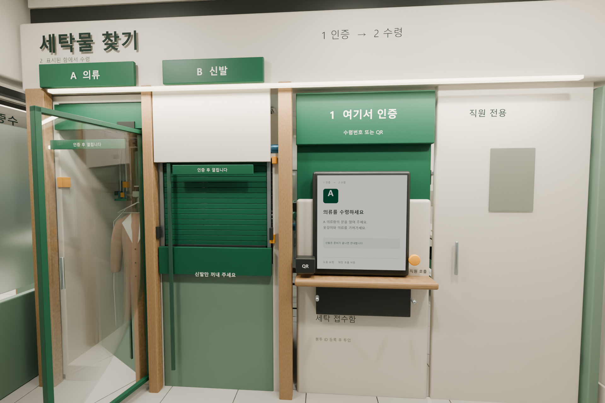</td>
<td>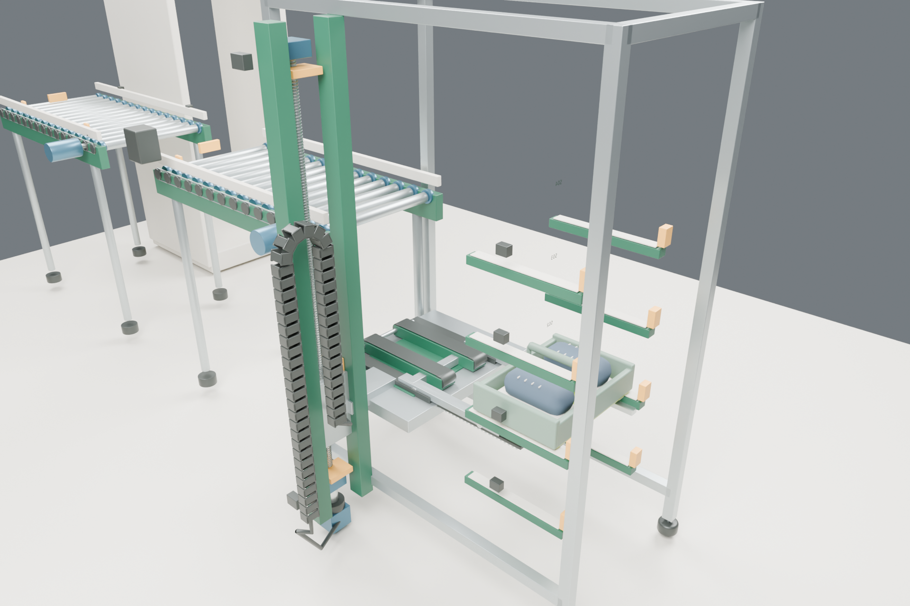</td>
</tr>
<tr>
<td align="center"><sub>08 고객 수령 — "1 인증 → 2 수령" 안내, A 의류 유리문, B 신발 셔터, 수령을 안내하는 키오스크</sub></td>
<td align="center"><sub>04 신발 승강과 포크 (C03) — 승강 타워, 텔레스코픽 포크, 케이블 체인, 롤러 인피드</sub></td>
</tr>
</table>

<table>
<tr>
<td>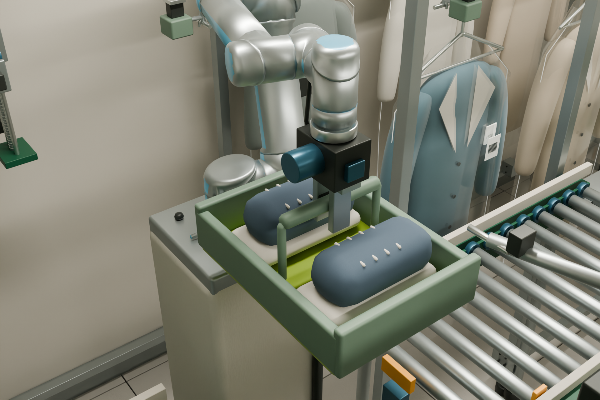</td>
<td>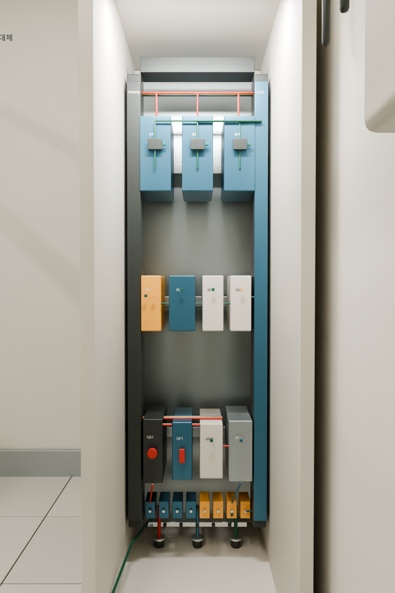</td>
</tr>
<tr>
<td align="center"><sub>12 로봇 트레이 이송 (C05) — 트레이를 손잡이로 잡고 받침대 위로 높여 옮기는 중앙 이송 포즈</sub></td>
<td align="center"><sub>07 제어반 (C04) — 차단기, 접촉기, 24 V 전원, 안전 릴레이, PLC, I/O를 나눠 배치한 정비 컨셉</sub></td>
</tr>
</table>

<p align="center">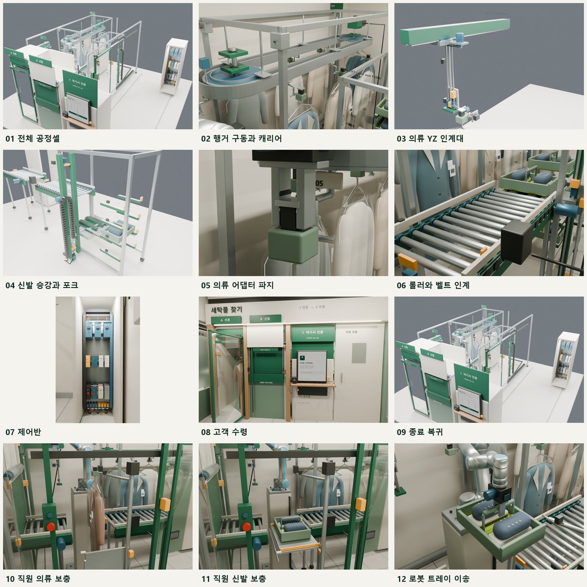</p>
<p align="center"><sub>공정 갤러리 — 01 전체 공정셀부터 12 로봇 트레이 이송까지 12장을 한 장에 모았습니다.</sub></p>

## 6. 자료 보는 방법

설치하거나 빌드할 소프트웨어가 없는 문서·미디어 저장소입니다.

**필요한 것**: 웹 브라우저. 자막과 함께 보려면 외부 SRT 자막을 불러올 수 있는 동영상 재생기.

```bash
git clone https://github.com/lsy041015/capstone-design-hanyang-university.git
cd capstone-design-hanyang-university

# 예: mpv에서 영문 자막을 붙여 재생 (한국어 대사는 process_v7_ko.srt)
mpv --sub-file=videos/process_v7_en.srt videos/process_v7_teaser_120s_1080p30.mp4
```

- 읽는 순서: 이 README → [docs/v7_process_teaser.md](docs/v7_process_teaser.md)(장면별 설명, 검증 범위, 버전 구분) →
  [docs/v7_video_verification.json](docs/v7_video_verification.json)(게시 영상 검증 기록).
- 영상 두 개를 합치면 약 50 MB입니다.
- 편집 가능한 Blender 모델(`.blend`)과 제작 스크립트는 들어 있지 않습니다. 모델을 직접 열거나 검사를 다시 돌릴 수는 없습니다.

## 7. 운영 흐름

제안하는 서비스 운영 순서입니다. 모델의 번호 프레임 31개는 **따로 저장한 검사 포즈**이며, 경과 시간이나 연속 사이클을 증명하지 않습니다.
1번 프레임은 수령을 기다리는 재고를, 23–31번은 수령 장면 뒤의 보충을 보여 줍니다. 실제 순서에서는 직원 적재가 먼저 일어나야
새 물품을 보관하고 나중에 찾아갈 수 있습니다.

### 1. 직원 검수와 물품 등록

- 직원이 세탁 완료된 의류나 신발을 확인하고 포장한 뒤, 직원 단말기에서 물품 ID를 고객 주문 ID에 연결합니다.
- 중복 ID, 부적합한 물품이나 포장, 빈 보관 위치가 없는 주문은 적재를 시작하기 전에 거부하는 흐름입니다.
- 검수·포장·등록은 직원의 일로 남깁니다. 세탁기에서 젖은 빨래를 꺼내거나 옷을 자동으로 거는 기능은 주장하지 않습니다.

### 2. 보호된 적재와 보관 — C07, C05, C01, C03

- 빈 의류 어댑터나 신발 트레이를 공용 직원 보충구 C07로 가져옵니다.
- 고객 인출을 멈추고 로봇이 원위치에 있을 때, 서비스 상태에서만 가드 슬라이딩 도어가 열립니다.
- 의류를 전용 어댑터에 걸 때는 트레이 선반을 접고, 신발은 선반을 펼쳐 포장된 한 켤레를 트레이에 담습니다.
- 문을 닫고 잠근 뒤 작업자가 리셋해야 자동 동작이 다시 시작됩니다.
- 로봇은 옷감이나 신발이 아니라 **단단한 어댑터 탭이나 트레이 손잡이**를 잡습니다.
- 의류는 적재한 어댑터를 C01 루프의 빈 캐리어로 옮깁니다. 신발은 트레이를 C03 인피드에 놓고, 롤러·벨트·승강대·텔레스코픽 포크가 4단 중 한 곳에 넣습니다.
- 재고 기록은 목적지·물품 ID·존재 확인이 모두 맞은 뒤에야 임시에서 점유로 바뀝니다.
- 저장된 보충 포즈는 23–31번 프레임입니다. 의류 한 벌과 신발 트레이 하나의 보충을 보여 줄 뿐, 측정한 적재 시간이 아닙니다.

### 3. 고객 인증과 예약

- 고객은 키오스크에서 수령번호를 입력하거나 QR 코드를 보여 줍니다.
- 제어 흐름은 주문, 수령 권한, 물품 위치를 확인한 뒤 물품을 예약해, 같은 재고를 두 요청이 가져가지 못하게 합니다.
- 기구가 물품을 준비하는 동안 A 의류함과 B 신발함은 닫혀 있습니다.
- 고객 화면은 **1 인증 → 2 수령** 두 단계입니다. 의류와 신발은 A·B로 표시한 별도 수령함을 씁니다.
  키오스크는 수령번호 입력과 QR 리더를 지원하고, 인증이나 인출이 실패할 때 쓰는 도움 요청 버튼이 눈에 띄게 있습니다.
- 키오스크 화면과 논리 조건은 컨셉으로 표현했습니다. 실제 결제·QR·주문·재고 서버는 구현하지 않았습니다.

### 4. 의류 선택과 로봇 인계 — C01, C05, 프레임 2–6

- C01 캐리어 루프가 요청한 의류를 로봇 픽업 위치로 인덱싱하고 목표 위치에서 잠급니다.
- 캐리어와 물품 ID를 확인한 뒤, 로봇이 의류용 조를 어댑터의 단단한 탭에 닫고, 아래가 열린 받침에서 어댑터를 들어 올려 C02 수령대 받침으로 옮깁니다.
- 유지 래치가 어댑터를 잡은 다음에 그리퍼가 놓습니다.
- 포즈는 인덱싱·잠금·파지·들어 올림·내려놓기를 보여 주지만, 포즈 사이의 연속 로봇 궤적이 충돌 없이 이어진다는 증명은 아닙니다.

### 5. 의류 전달과 어댑터 회수 — C02, C06, 프레임 7–10

- 로봇이 비켜나고 고객문이 잠긴 상태에서 내부문이 열립니다.
- C02 Z 모듈 전체가 Y 캐리지와 함께 공칭 **Y 730 mm**를 이동한 뒤, 의류를 **300 mm** 내려 고객 수령 위치로 보냅니다.
- 내부문이 닫히고 잠겨야 바깥 의류문의 잠금이 풀립니다.
- 고객은 옷걸이와 의류를 가져가고, 운반 어댑터는 셀 안에 남아 회수를 기다립니다.
- 물품 제거와 문 닫힘을 확인해야 주문이 수령 완료로 바뀌고 빈 어댑터를 회수합니다. 문이나 물품 확인이 실패하면 다음 동작을 막아 둡니다.

### 6. 신발 인출과 이송 — C03, C05, 프레임 11–18

- C03 승강대가 신발 주문에 배정된 선반에서 멈춥니다.
- 3단 포크가 선반 안으로 **600 mm** 뻗고, 틈을 만들려고 트레이를 **20 mm** 들어 올린 뒤 빠져나와 벨트 인계 높이로 이동합니다. 이어서 트레이를 벨트에 내려놓습니다.
- 연결 롤러가 트레이를 인피드 스토퍼까지 옮기고, 로봇이 집기 전에 존재와 ID를 확인합니다.
- 로봇은 트레이 손잡이를 잡아 셀 중앙을 지나 출구 롤러에 내려놓습니다.
- 벨트와 롤러 윗면은 공칭 **1,080 mm** 인계 높이를 공유합니다. 모델의 설계 치수이며, 시험한 운반 성능이 아닙니다.

### 7. 신발 수령과 빈 트레이 반송 — C06, C03, 프레임 19–22

- 트레이는 고객 셔터가 잠긴 채로 B 신발함에 도착합니다.
- 로봇이 원위치로 돌아간 뒤 내부 셔터가 열려 트레이를 받고, 닫고 잠근 다음에 외부 셔터가 열립니다.
- 고객은 신발과 포장만 가져가고 재사용 트레이는 남깁니다.
- 물품 제거와 외부 셔터 닫힘 뒤에야 빈 트레이가 내부 경로로 돌아갑니다. 로봇·인피드·벨트·승강대·포크가 빈 보관 위치로 되돌리고,
  반송 확인이 끝나면 재고 기록을 지웁니다.

### 8. 이상 확인과 리셋

- 해당 동작을 허용하기 전에 서비스 도어 닫힘, 비상정지 상태, 작업자 리셋, 로봇 원위치, 문 인터록, 장애물, 시간 초과, 물품 ID, 적재 여부,
  파지 확인을 검사하는 순서입니다.
- 검사가 실패하면 물품이나 운반구를 정해진 위치에 붙잡아 두고, 주문을 조용히 완료하지 않고 작업자 확인을 요청합니다.
- 이것은 **설계 요구사항이자 모델에서 시험한 논리 조건**입니다. 실제 PLC, 독립 안전 회로, 검증된 복구 절차가 아닙니다.

<a id="system-architecture"></a>

## 8. 기구 구성

셀은 C01–C07 일곱 개 기구로 나뉩니다. 치수는 모델의 공칭 설계값입니다.

| 코드 | 기구 | 구성과 사양 |
|---|---|---|
| **C01** | 의류 보관 컨베이어 | 연속 가이드 캐리어 루프입니다. 설계 피치 25.4 mm, 링크 212개, 54치 스프로킷 2개. 캡티브 트롤리 휠, 체인 연결, 구동부, 텐셔너, 엔코더, 인덱스 잠금 핀을 표현했습니다. 소매가 덜 겹치도록 의류를 레일 접선 방향으로 정렬합니다. |
| **C02** | 의류 이송축 | 수직 가이드를 고정해 두지 않고, Y축 캐리지가 Z축 조립체 전체를 싣고 움직입니다. 공칭 행정은 Y 730 mm, Z 300 mm. 수령대 받침의 유지 래치가 어댑터를 잡으므로 로봇이 고객 전달 전에 어댑터를 놓을 수 있습니다. |
| **C03** | 신발 승강·포크·롤러 이송 | 가이드 승강대와 3단 텔레스코픽 포크가 신발 보관 4단을 맡습니다. 포크는 수평 600 mm, 중첩된 단 사이 겹침 최소 130 mm, 별도 수직 인계 동작 20 mm. 인피드·출구 컨베이어는 지름 40 mm 롤러를 80 mm 피치로 놓고 연동 구동부와 측면 가이드를 갖췄습니다. |
| **C04** | 전기·제어반 | 주 차단기, 회로 보호, 접촉기, 24 V 전원, 안전 릴레이, PLC, 디지털 I/O, 모터 드라이브, 단자대, 보호 접지, 케이블 덕트, 케이블 글랜드를 구분해 배치했습니다. 인증된 전기 회로도가 아니라 공간·정비 배치 컨셉입니다. |
| **C05** | 로봇 엔드 이펙터 | 교체형 조(jaw)에 접촉면이 두 가지입니다. 평평한 아래면 그립은 의류 어댑터 스템을, V자 패드는 신발 트레이 손잡이를 잡습니다. 옷감이나 신발을 직접 잡지 않고 단단한 어댑터와 트레이만 다룹니다. |
| **C06** | 인터록 고객 수령함 | 의류함은 프레임 여닫이문, 신발함은 롤링 슬랫 셔터(가이드, 튜브 모터, 감시 잠금, 손 감지, 감압식 하단 엣지)입니다. 내부문과 고객문은 동시에 열리지 않도록 설계했습니다. |
| **C07** | 직원 보충구 | 가드 슬라이딩 도어, 비상정지, 리셋 버튼, ID 리더, 의류 도킹 핀, 접이식 신발 트레이 선반. 선반은 트레이를 실을 때 펼치고, 의류를 걸 때는 간섭하지 않도록 접습니다. |

C03·C04·C06의 렌더(04, 07, 08)는 [렌더 갤러리](#5-렌더-갤러리)에 있습니다.

<table>
<tr>
<td>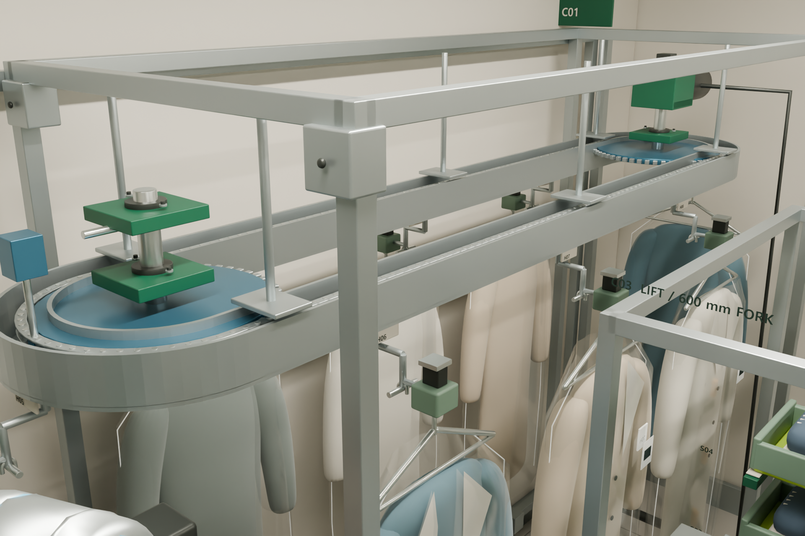</td>
<td>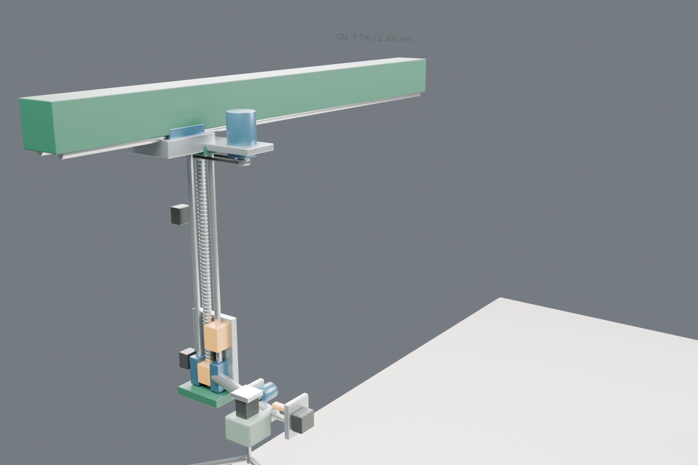</td>
</tr>
<tr>
<td align="center"><sub>02 행거 구동과 캐리어 (C01) — 레일 루프, 구동 스프로킷, 의류가 걸린 캐리어</sub></td>
<td align="center"><sub>03 의류 YZ 인계대 (C02) — Z 리드스크루 기둥을 실은 Y 빔, "Y 730 / Z 300 mm" 표시</sub></td>
</tr>
</table>

<table>
<tr>
<td>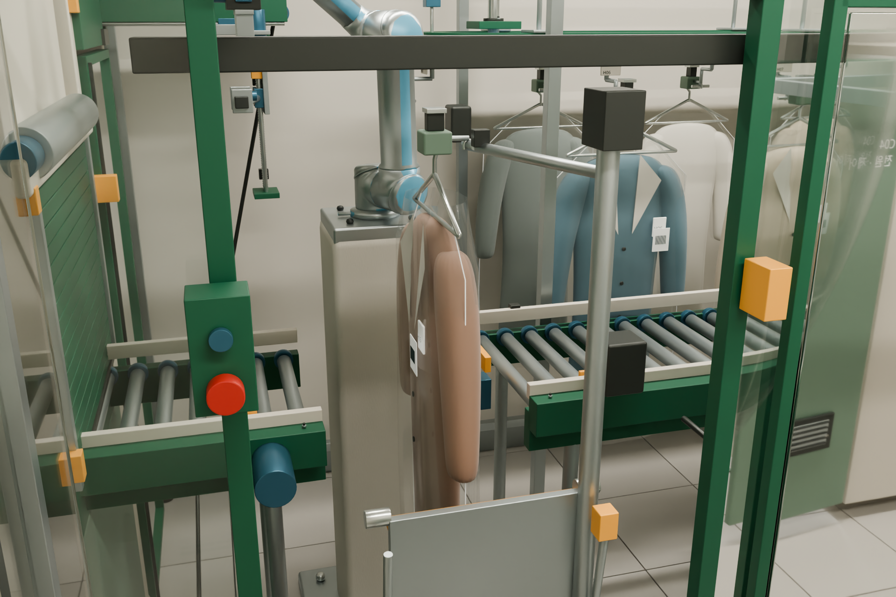</td>
<td>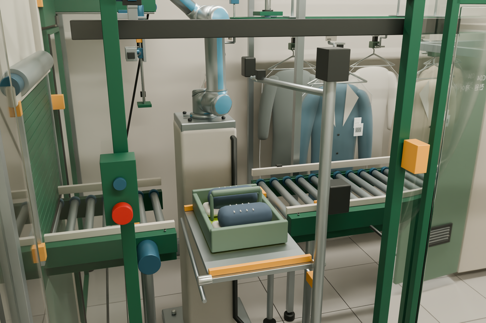</td>
</tr>
<tr>
<td align="center"><sub>10 직원 의류 보충 (C07) — 보충구에 걸린 의류와 로봇, 비상정지·리셋 버튼</sub></td>
<td align="center"><sub>11 직원 신발 보충 (C07) — 펼친 접이식 선반 위의 신발 트레이</sub></td>
</tr>
</table>

### 이송 상세

신발 트레이가 로봇과 롤러 사이를 오갈 때의 치수입니다.

- 로봇은 신발 트레이의 단단한 손잡이를 잡아 롤러 컨베이어에 내려놓습니다.
- 검토 중 로봇 받침대를 피하도록 중앙 트레이 이송 포즈를 높였습니다. 이 포즈의 공칭 로봇 TCP는 모델 바닥에서 1,700 mm, 트레이 원점은 1,545 mm입니다
  (갤러리의 12번 렌더).
- 롤러와 벨트 인계면은 1,080 mm로 맞췄습니다. 201개 표본 위치에서 320 mm 트레이 바닥을 두 컨베이어 레인 모두 롤러 4개 이상이 받쳤습니다.

<table>
<tr>
<td>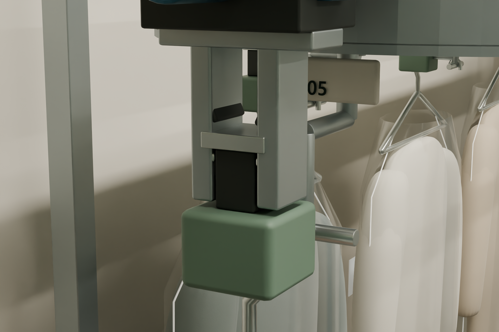</td>
<td>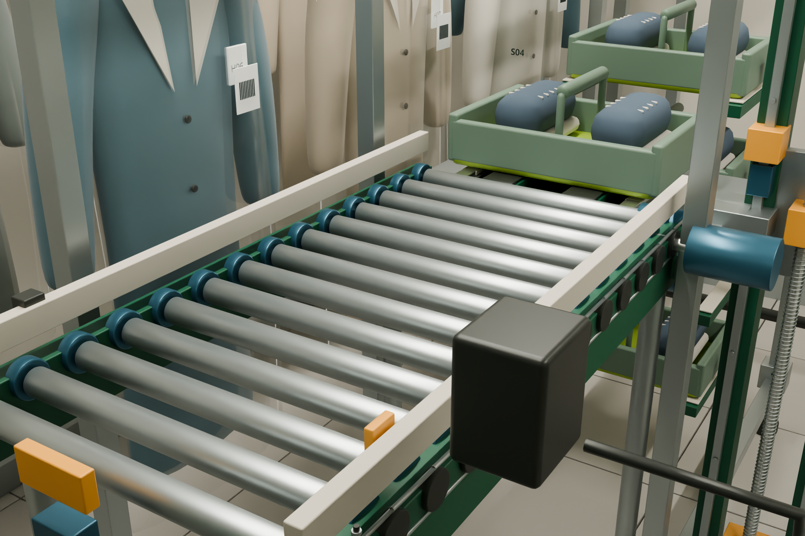</td>
</tr>
<tr>
<td align="center"><sub>05 의류 어댑터 파지 (C05) — 그리퍼의 평평한 패드가 단단한 어댑터 탭을 잡음</sub></td>
<td align="center"><sub>06 롤러와 벨트 인계 (C03) — 신발 트레이를 승강대 쪽으로 보내는 롤러 컨베이어</sub></td>
</tr>
</table>

## 9. 설계 검토와 검증

설계는 내부 검토로 점수를 매겼고, 모델과 영상은 스크립트로 기하 검사를 했습니다. 모두 Blender 모델 위의 검사이며,
연속 궤적이 충돌 없이 이어진다는 증명이나 하드웨어 안전 검증이 아닙니다.

### 컨셉 검토: 32/100 → 74/100

수정한 설계는 내부 컨셉 검토에서 **74/100**을 받았습니다. 보여 주기 중심이던 이전 배치는 32/100이었습니다.
이 점수는 작성자 자체 평가이며 인증이나 안전 승인이 아닙니다. 검토하면서 고친 것은 다음 10가지입니다.

1. 의류 시연 용량을 10슬롯에서 8슬롯으로 줄여 의류 외곽끼리 겹치지 않게 했습니다.
2. 이웃한 의류를 모두 같은 방향으로 두지 않고, 컨베이어 접선 방향을 따르도록 돌렸습니다.
3. Z축 조립체를 움직이는 Y 캐리지에 연결했습니다.
4. 로봇 링크와의 간섭을 확인한 뒤 의류 이송 빔을 옮겼습니다.
5. 듬성듬성하던 출구 롤러를 80 mm 피치 배치로 바꿨습니다.
6. 가이드 승강대, 중첩 포크 단, 끝단 들어 올림(tip-lift) 인계, 브레이크, 리밋, 범퍼, 길이가 일정한 케이블 체인을 추가했습니다.
7. 서로 겹치던 의류 핀을 아래가 열린 들어 올려 빼는(lift-off) 받침으로 바꿨습니다.
8. 가드가 있는 직원 보충 절차와 빈 운반구 자동 반송을 추가했습니다.
9. 닫힌 신발 셔터 둘레에 고정 상·하부 막음 패널을 추가했습니다.
10. 트레이와 로봇 받침대의 충돌을 발견해 중앙 신발 트레이 이송 포즈를 높였습니다.

### 원본 검사 모델: 자동 검사 177개

원본 v7 검사 모델은 자동 검사 177개를 통과했습니다. 주요 항목은 다음과 같습니다.

- 정지 검사 포즈 31개
- 저장된 포즈에서 공칭 TCP 위치 오차 최대 약 0.0098 mm
- 201개 인덱스 위치에서 560 × 140 mm 의류 외곽 사이 겹침 0
- 의류 사이 분리축(separating-axis) 최소 간격 약 113.10 mm
- 두 컨베이어 경로 전체에서 320 mm 트레이 아래 지지 롤러 4개 이상
- 검사한 포즈에서 포크–트레이 인계 접촉 0.1 mm 이내
- 문 상태, 비상정지, 리셋, 장애물, 시간 초과, ID, 적재, 파지 확인에 대한 실패 시 닫힘(fail-closed) 논리 검사
- 31개 저장 포즈에서 선택한 로봇·툴 메시와 선택한 주변 강체 부품 1,685개 사이 삼각형 교차 검출 없음
- 저장된 포즈에서 움직이는 의류·트레이와 선택한 받침대·프레임·가드·로봇 메시 사이 교차 검출 없음

### v7 영상 검증

영상 파일은 원본 검사 모델과 따로 검사했습니다. 근거는 [docs/v7_process_teaser.md의 검증 범위](docs/v7_process_teaser.md#검증-범위)와
[docs/v7_video_verification.json](docs/v7_video_verification.json)입니다.

| 확인 항목 | 결과와 범위 |
|---|---|
| 원본 보존 | 원본 Blender 파일의 SHA-256을 제작 전후로 비교했습니다. 31개 검사 포즈를 덮어쓰지 않고 영상용 파일을 따로 만들었습니다. |
| 전체 프레임 계산 | 명령 위치 3,600개 모두에서 UR5 공칭 역기구학, 의류·신발 양쪽 문의 동시 개방 금지, 보충구가 열린 동안 로봇 정지, 트레이 파지 오프셋을 검사했습니다. 공칭 TCP 최대 오차는 약 0.0248 mm이며 수치 계산 잔차입니다. |
| 저장된 애니메이션 | 저장한 파일을 다시 열어 표본 351프레임에서 TCP, 카메라 전환, Y–Z 연동, 의류 문 상태를 검사했습니다. 저장 좌표의 최대 TCP 잔차는 약 0.0198 mm입니다. |
| 선택한 강체 간섭 | 표본 프레임에서 보이는 의류·트레이와 선택한 받침대·프레임·레일·로봇 링크 사이에 삼각형 교차가 없었습니다(0건). 표본 사이 구간까지 포함한 연속 충돌 검사는 아닙니다. |
| 게시 파일 | 판정 `PASS`. 1920×1080, 30 fps, 120.0초, 3,600프레임 전체 디코딩 통과, 자막 트랙 0개, 챕터 21개. 음성 최대 약 -2.0 dBFS, 장면별 RMS -19.8 ~ -17.7 dBFS. |

- 게시 MP4의 SHA-256: `e23c7f0ac8fb6980a4849bce0c312be8e3feea5e0cb3d035f861ee1cb7fe3d0a`
- 검증 기록이 밝힌 범위: 공칭 위치와 선택한 표본 강체 검사만 포함합니다. 전체 연속 스윕 볼륨, 로봇 자가 충돌, 유연한 의류 거동,
  실제 FR5e, 하중, 하드웨어 안전 인증은 빠져 있습니다.

<p align="center">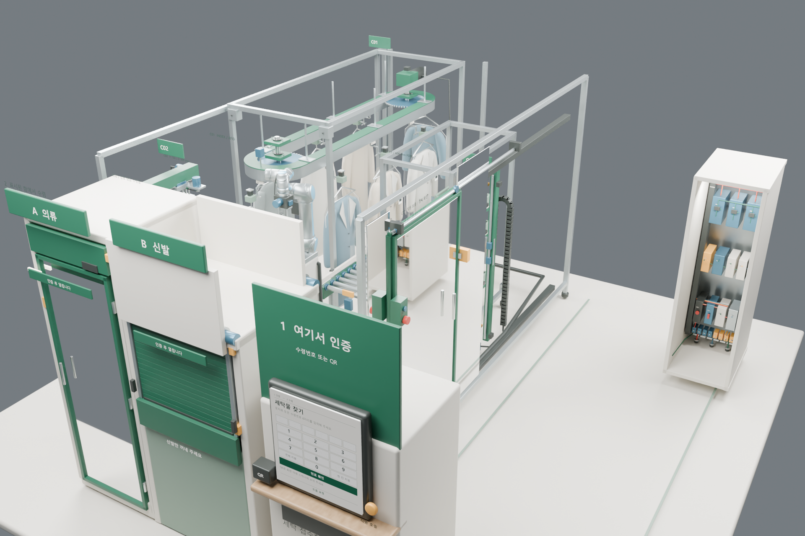</p>
<p align="center"><sub>09 종료 복귀 — 수령과 빈 운반구 회수를 마친 뒤의 셀 상태</sub></p>

## 10. 저장소 구조

공개 저장소에는 이미지, v7 티저, 이전 v4 영상, 한국어·영문 자막, 공정 설명, 영상 검증 기록이 있습니다.

```text
capstone-design-hanyang-university/
├── README.md                     # 프로젝트 설명 (한국어)
├── README.en.md                  # 프로젝트 설명 (영어)
├── assets/capstone-banner.png    # README 배너
├── docs/
│   ├── v7_process_teaser.md        # v7 영상 장면별 설명, 검증 범위, 버전 구분 (한국어)
│   ├── v7_video_verification.json  # 게시 영상 검증 기록: 해시, 디코딩, 음성, 챕터
│   └── UR5_LICENSE.txt             # UR5 메시의 BSD-3-Clause 고지
├── images/                       # 렌더 12장(01–12), 모음 이미지, 영상 포스터
└── videos/
    ├── process_v7_teaser_120s_1080p30.mp4   # 현재 v7 티저: 2:00, 21장면, 25.7 MB
    ├── process_v7_ko.srt                    # 한국어 대사 (외부 자막)
    ├── process_v7_en.srt                    # 영문 자막 (외부 자막)
    └── process_v4_60s_1080p30.mp4           # 이전 v4 영상: 60초, 86단계, 24.3 MB
```

편집 가능한 Blender 모델과 제작 스크립트는 포함하지 않았습니다.

## 11. 기술 스택

설계와 영상 제작에 쓴 도구와 외부 자료입니다. 버전은 저장소에 기록된 것만 적었습니다.

| 도구·자료 | 쓰임 | 버전·고정 |
|---|---|---|
| Blender | 3D 모델, 31개 검사 포즈, v7 영상 | 기록 없음. `.blend` 파일은 없고 해시만 검증 기록에 있음 |
| UR5 CB-series 메시 | 목표 기종 FR5e 대신 쓴 로봇 형상과 공칭 기구학 | Universal Robots ROS 2 Description 커밋 `89bbe795f38a7ab00fb66fe8831dfff79dc99edf` |
| Microsoft Heami Desktop | 한국어 합성 내레이션 (Windows 음성) | 기록 없음 |
| 게시 영상 | H.264(yuv420p) 1920×1080 30 fps, AAC 48 kHz 2채널 | `docs/v7_video_verification.json` |
| 검증 기록 | 해시, 디코딩, 음량, 표본 프레임 검사 결과를 JSON으로 남김 | 사용한 스크립트·도구 이름은 저장소에 없음 |

## 12. 만들면서 고민한 것

- **로봇은 옷감과 신발을 잡지 않습니다.** C05 그리퍼는 평평한 아래면으로 의류 어댑터의 단단한 탭을, V자 패드로 신발 트레이 손잡이를 잡습니다.
  고객은 옷걸이와 의류, 또는 신발만 가져가고 어댑터와 트레이는 셀 안에 남아 다시 쓰입니다(`images/05_garment_adapter_grip.png`).
- **트레이가 로봇 받침대에 부딪혔습니다.** 검토 중 중앙 트레이 이송 포즈에서 트레이와 받침대의 충돌을 찾아 포즈를 높였습니다.
  지금 이 포즈의 공칭 TCP는 모델 바닥에서 1,700 mm, 트레이 원점은 1,545 mm입니다. 영상에서도 로봇은 받침대를 피해 트레이를 들어 올린 뒤 옮깁니다
  (`images/12_robot_tray_transfer.png`).
- **32점에서 74점으로.** 보여 주기 중심이던 이전 배치는 내부 컨셉 검토에서 32/100이었습니다. 의류를 10슬롯에서 8슬롯으로 줄여 외곽 겹침을 없애고,
  Z축을 움직이는 Y 캐리지에 싣는 등 10가지를 고쳐 74/100이 됐습니다. 작성자 자체 평가입니다([9절](#9-설계-검토와-검증)).
- **영상에도 기계가 읽을 수 있는 검사 기록이 있습니다.** `docs/v7_video_verification.json`에는 MP4의 SHA-256, 3,600프레임 전체 디코딩 결과,
  21장면별 음량(RMS), 자막 트랙 0개, 원본·영상 Blender 파일의 해시가 들어 있습니다. 영상을 만드는 동안 원본 검사 모델이 바뀌지 않았는지도
  제작 전후 해시로 비교했습니다.
- **대체 로봇은 커밋까지 고정했습니다.** 적용 대상은 FR5e지만 렌더와 영상 속 로봇은 Universal Robots의 공식 UR5 CB-series 메시입니다.
  출처를 ROS 2 Description 저장소의 커밋 `89bbe795…`로 고정하고 BSD-3-Clause 고지(`docs/UR5_LICENSE.txt`)를 함께 두었습니다.
  UR5 사양을 FR5e 성능으로 쓰지 않습니다.
- **문은 한쪽씩만 열립니다.** 의류는 내부문이 닫히고 잠겨야 고객문이 열리고, 신발은 외부 셔터가 잠긴 동안에만 내부 셔터가 열립니다.
  고객이 물품을 꺼내고 문이 닫혀야 빈 운반구 회수가 시작됩니다. 영상 검증은 3,600프레임 전체에서 의류·신발 양쪽 문의 동시 개방이 없는지
  계산했습니다(`docs/v7_process_teaser.md`).

## 13. 한계와 다음 단계

이 저장소는 시각·기하 컨셉을 기록합니다. 실제로 만들 수 있는 기계임을 보여 주지 않습니다. 제작이나 상용 배치 전에 다음 작업이 필요합니다.

- UR5 대체 형상과 공칭 기구학을 실제 FR5e CAD, 캘리브레이션, 가반 하중, 툴 질량, 무게중심으로 바꿔야 합니다.
- 연속 로봇 궤적, 접근·이탈 경로, 전체 자가 충돌, 의류 거동을 검증해야 합니다.
- 모터 토크, 브레이크 용량, 포크 처짐, 프레임 강성, 진동, 공차, 파지력, 정격 하중 한계를 계산해야 합니다.
- 실제 구매 부품을 고르고 제작 도면, 배선도, 열·전자파 적합성(EMC) 검토를 만들어야 합니다.
- 실제 PLC, 로봇 제어기, 독립 안전 회로, 정지 거리, 재시작 절차, 고장 복구를 구현하고 검증해야 합니다.
- 직원의 손이 닿는 범위, 적재 시간, 청소 접근성, 고객 접근성, 정비 작업을 실물로 사용성 시험해야 합니다.
- 결제, QR, 주문, 재고, 알림 서비스를 검증해야 합니다. 지금은 화면과 논리 조건만 있습니다.

그 밖의 주의점입니다.

- 시연 슬롯 수(의류 8, 신발 트레이 4)를 상용 매장의 용량이나 수익성으로 해석하면 안 됩니다.
- 영상의 120초와 31개 포즈 번호는 사이클 타임이 아닙니다.
- 편집 가능한 `.blend` 파일과 제작 스크립트가 없어서, 저장소만으로는 모델을 열거나 검사를 재현할 수 없습니다.

## 14. 출처와 라이선스

이 저장소에 쓰인 외부 자료와 권리 표시입니다.

- **라이선스**: 저장소 전체에 적용되는 라이선스 파일은 없습니다. 아래 UR5 고지는 UR5 메시에만 해당하며, 이 저장소의 글·이미지·영상에는 적용되지 않습니다.
- **UR5 메시**: 렌더와 영상 속 로봇은 Universal Robots의 공식 UR5 CB-series 단순화 STL 형상입니다. 출처는
  [Universal Robots ROS 2 Description](https://github.com/UniversalRobots/Universal_Robots_ROS2_Description/tree/89bbe795f38a7ab00fb66fe8831dfff79dc99edf/meshes/ur5/collision)의
  커밋 `89bbe795f38a7ab00fb66fe8831dfff79dc99edf`로 고정했고, BSD-3-Clause 고지는 [docs/UR5_LICENSE.txt](docs/UR5_LICENSE.txt)에 있습니다.
  이 프로젝트의 창작물이 아닙니다.
- **대체 로봇 주의**: 적용을 검토한 로봇은 FR5e입니다. UR5 메시는 배치와 공칭 기구학 검토를 위한 대체물이며, UR5 사양·형상을 FR5e 성능 자료로 제시하면 안 됩니다.
- **내레이션 음성**: Windows Microsoft Heami Desktop 한국어 합성 음성입니다. 별도 배경 음악은 쓰지 않았습니다.
- **참고 자료**: [Universal Robots UR5 기술 사양서](https://www.universal-robots.com/media/1828033/ur5_tech_spec_web_en.pdf) ·
  [Universal Robots ROS 2 Description 저장소](https://github.com/UniversalRobots/Universal_Robots_ROS2_Description) ·
  [Metalprogetti 자동 드라이클리닝 시스템](https://www.metalprogetti.it/en/products/automated-dry-cleaning/)

한양대학교 캡스톤디자인 · 무인 세탁물 수령 시스템

---

<p align="center"><sub>LSY.KOR · <a href="https://github.com/lsy041015">다른 프로젝트 보기</a></sub></p>
