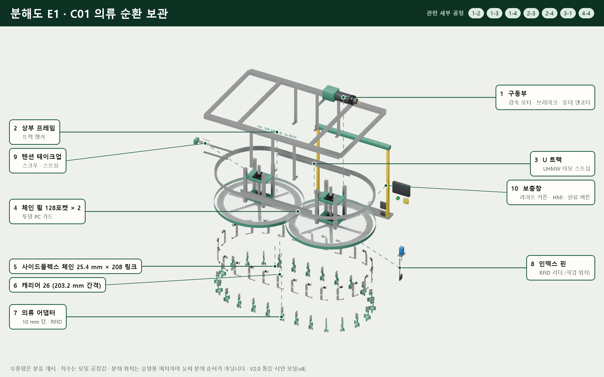
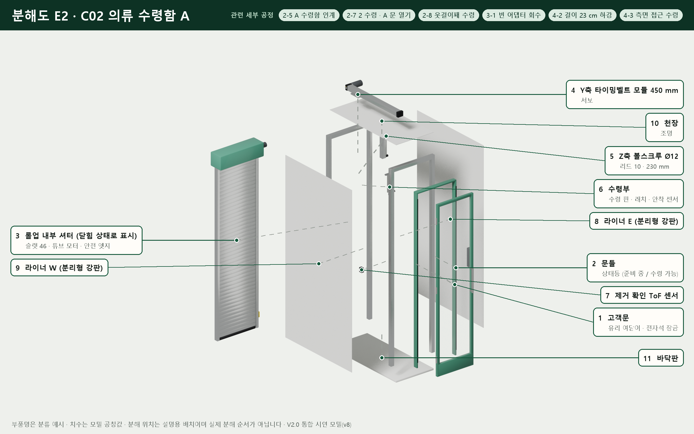
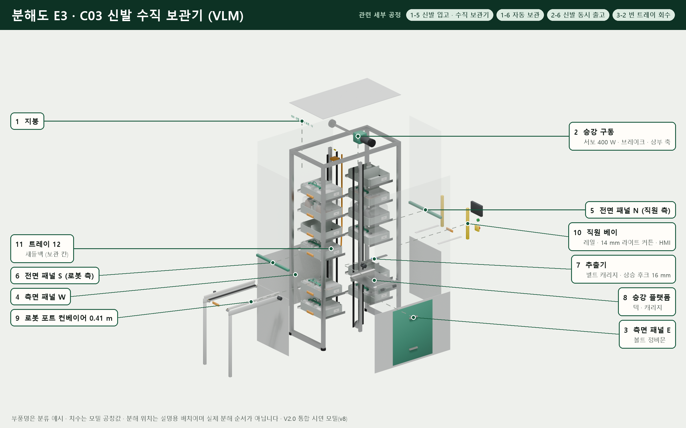
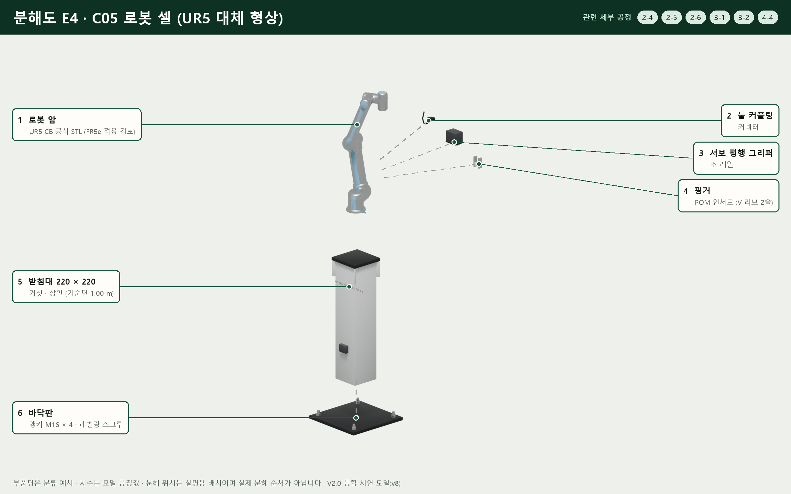
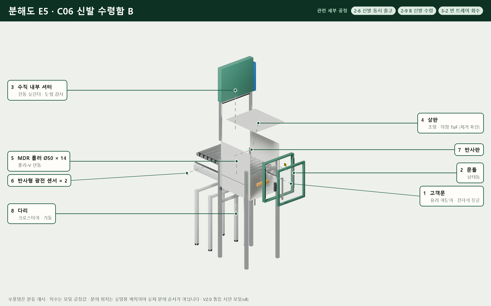
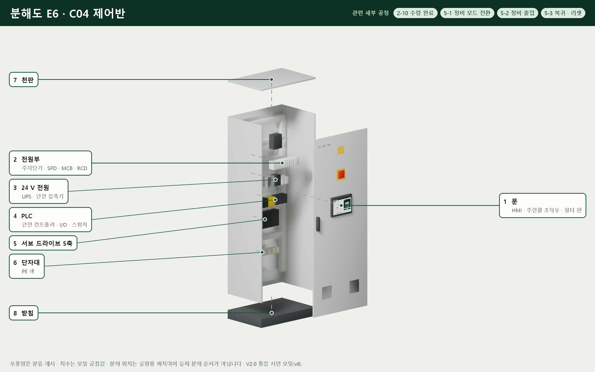
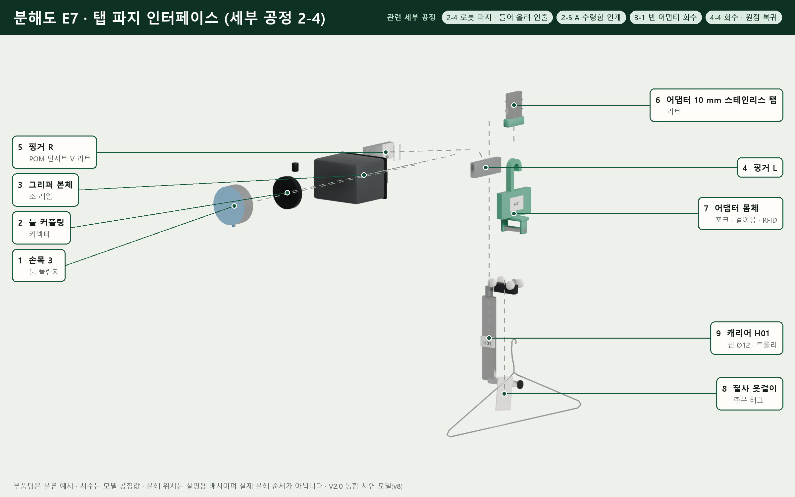
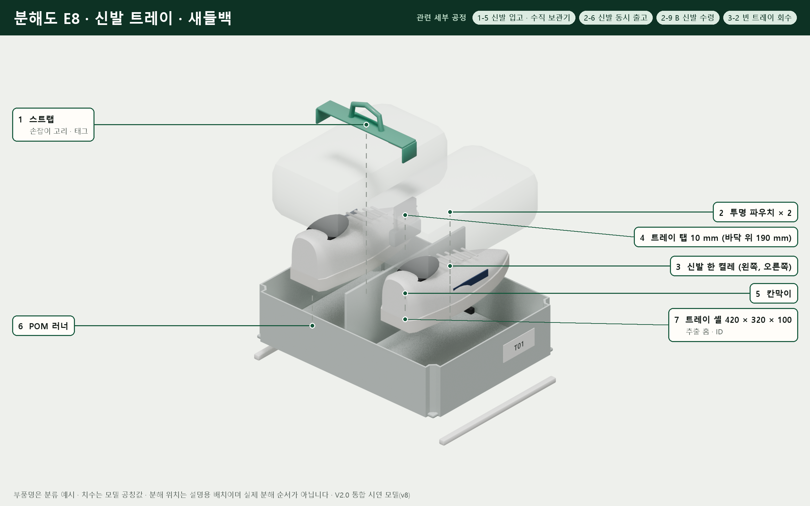

# V2.0 기구 분해도

V2.0 통합 시연 모델(내부 버전 v8)의 모듈을 부품 그룹별로 벌려 놓고 정사영으로 렌더한 분해도 8장입니다. 번호는 이미지 속 이름표 번호와 같습니다. 분해 위치는 설명용 배치이며 실제 분해 순서가 아닙니다. 부품명은 분류 예시이고 치수는 모델 공칭값입니다. [README로 돌아가기](../README.md)

## E1 · C01 의류 순환 보관

관련 세부 공정: 1-2 빈 캐리어 호출, 1-3 보충창에 걸기, 1-4 보충 완료 · 재고 등록, 2-3 루프 인덱싱 · 잠금, 2-4 로봇 파지 · 들어 올려 인출, 3-1 빈 어댑터 회수, 4-4 회수 · 원점 복귀

| 번호 | 부품 그룹 |
|---|---|
| 1 | 구동부 · 감속 모터 · 브레이크 · 절대 엔코더 |
| 2 | 상부 프레임 · 트랙 행거 |
| 3 | U 트랙 · UHMW 마모 스트립 |
| 4 | 체인 휠 128포켓 × 2 · 투명 PC 가드 |
| 5 | 사이드플렉스 체인 25.4 mm × 208 링크 |
| 6 | 캐리어 26 (203.2 mm 간격) |
| 7 | 의류 어댑터 · 10 mm 탭 · RFID |
| 8 | 인덱스 핀 · RFID 리더 (픽업 위치) |
| 9 | 텐션 테이크업 · 스크루 · 스프링 |
| 10 | 보충창 · 라이트 커튼 · HMI · 완료 버튼 |

## E2 · C02 의류 수령함 A

관련 세부 공정: 2-5 A 수령함 인계, 2-7 2 수령 · A 문 열기, 2-8 옷걸이째 수령, 3-1 빈 어댑터 회수, 4-2 걸이 23 cm 하강, 4-3 측면 접근 수령 (내부 셔터는 닫힘 상태로 표시)

| 번호 | 부품 그룹 |
|---|---|
| 1 | 고객문 · 유리 여닫이 · 전자석 잠금 |
| 2 | 문틀 · 상태등 (준비 중 / 수령 가능) |
| 3 | 롤업 내부 셔터 (닫힘 상태로 표시) · 슬랫 46 · 튜브 모터 · 안전 엣지 |
| 4 | Y축 타이밍벨트 모듈 450 mm · 서보 |
| 5 | Z축 볼스크루 Ø12 · 리드 10 · 230 mm |
| 6 | 수령부 · 수령 핀 · 래치 · 안착 센서 |
| 7 | 제거 확인 ToF 센서 |
| 8 | 라이너 E (분리형 강판) |
| 9 | 라이너 W (분리형 강판) |
| 10 | 천장 · 조명 |
| 11 | 바닥판 |

## E3 · C03 신발 수직 보관기 (VLM)

관련 세부 공정: 1-5 신발 입고 · 수직 보관기, 1-6 자동 보관, 2-6 신발 동시 출고, 3-2 빈 트레이 회수

| 번호 | 부품 그룹 |
|---|---|
| 1 | 지붕 |
| 2 | 승강 구동 · 서보 400 W · 브레이크 · 상부 축 |
| 3 | 측면 패널 E · 볼트 정비문 |
| 4 | 측면 패널 W |
| 5 | 전면 패널 N (직원 측) |
| 6 | 전면 패널 S (로봇 측) |
| 7 | 추출기 · 벨트 캐리지 · 상승 후크 16 mm |
| 8 | 승강 플랫폼 · 덱 · 캐리지 |
| 9 | 로봇 포트 컨베이어 0.41 m |
| 10 | 직원 베이 · 레일 · 14 mm 라이트 커튼 · HMI |
| 11 | 트레이 12 · 새들백 (보관 칸) |

## E4 · C05 로봇 셀 (UR5 대체 형상)

관련 세부 공정: 2-4 로봇 파지 · 들어 올려 인출, 2-5 A 수령함 인계, 2-6 신발 동시 출고, 3-1 빈 어댑터 회수, 3-2 빈 트레이 회수, 4-4 회수 · 원점 복귀

| 번호 | 부품 그룹 |
|---|---|
| 1 | 로봇 암 · UR5 CB 공식 STL (FR5e 적용 검토) |
| 2 | 툴 커플링 · 커넥터 |
| 3 | 서보 평행 그리퍼 · 조 레일 |
| 4 | 핑거 · POM 인서트 (V 리브 2줄) |
| 5 | 받침대 220 × 220 · 거싯 · 상판 (기준면 1.00 m) |
| 6 | 바닥판 · 앵커 M16 × 4 · 레벨링 스크루 |

## E5 · C06 신발 수령함 B

관련 세부 공정: 2-6 신발 동시 출고, 2-9 B 신발 수령, 3-2 빈 트레이 회수

| 번호 | 부품 그룹 |
|---|---|
| 1 | 고객문 · 유리 여닫이 · 전자석 잠금 |
| 2 | 문틀 · 상태등 |
| 3 | 수직 내부 셔터 · 전동 실린더 · 닫힘 감시 |
| 4 | 상판 · 조명 · 하향 ToF (제거 확인) |
| 5 | MDR 롤러 Ø50 × 14 · 폴리-V 연동 |
| 6 | 반사형 광전 센서 × 2 |
| 7 | 반사판 |
| 8 | 다리 · 크로스타이 · 기둥 |

## E6 · C04 제어반

관련 세부 공정: 2-10 수령 완료, 5-1 정비 모드 전환, 5-2 정비 출입, 5-3 복귀 · 리셋

| 번호 | 부품 그룹 |
|---|---|
| 1 | 문 · HMI · 주전원 조작부 · 필터 팬 |
| 2 | 전원부 · 주차단기 · SPD · MCB · RCD |
| 3 | 24 V 전원 · UPS · 안전 접촉기 |
| 4 | PLC · 안전 컨트롤러 · I/O · 스위치 |
| 5 | 서보 드라이브 5축 |
| 6 | 단자대 · PE 바 |
| 7 | 천판 |
| 8 | 받침 |

## E7 · 탭 파지 인터페이스 (세부 공정 2-4)

관련 세부 공정: 2-4 로봇 파지 · 들어 올려 인출, 2-5 A 수령함 인계, 3-1 빈 어댑터 회수, 4-4 회수 · 원점 복귀 · 마스터 56.5 s 상태

| 번호 | 부품 그룹 |
|---|---|
| 1 | 손목 3 · 툴 플랜지 |
| 2 | 툴 커플링 · 커넥터 |
| 3 | 그리퍼 본체 · 조 레일 |
| 4 | 핑거 L |
| 5 | 핑거 R · POM 인서트 V 리브 |
| 6 | 어댑터 10 mm 스테인리스 탭 · 리브 |
| 7 | 어댑터 몸체 · 포크 · 걸이봉 · RFID |
| 8 | 철사 옷걸이 · 주문 태그 |
| 9 | 캐리어 H01 · 핀 Ø12 · 트롤리 |

## E8 · 신발 트레이 · 새들백

관련 세부 공정: 1-5 신발 입고 · 수직 보관기, 2-6 신발 동시 출고, 2-9 B 신발 수령, 3-2 빈 트레이 회수

| 번호 | 부품 그룹 |
|---|---|
| 1 | 스트랩 · 손잡이 고리 · 태그 |
| 2 | 투명 파우치 × 2 |
| 3 | 신발 한 켤레 (왼쪽, 오른쪽) |
| 4 | 트레이 탭 10 mm (바닥 위 190 mm) |
| 5 | 칸막이 |
| 6 | POM 러너 |
| 7 | 트레이 셸 420 × 320 × 100 · 추출 홈 · ID |
